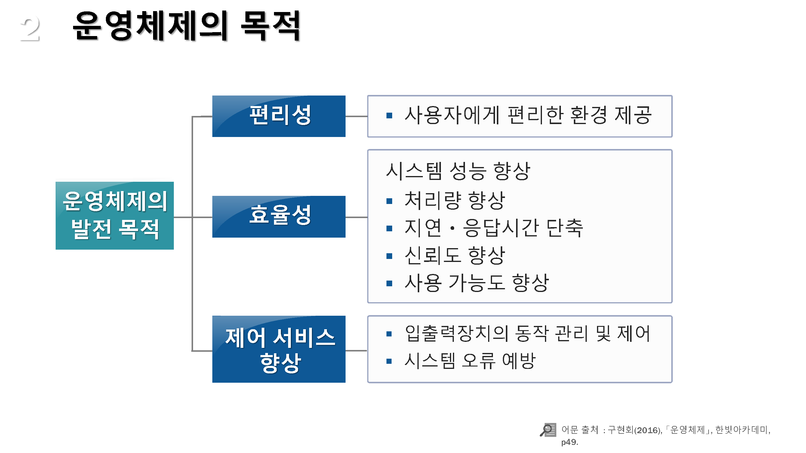

# 운영체제의 개념

* 운영제체의 정의와 역할
  * 운영체제의 정의
  * 사용자 관점의 운영제체 역할
  * 운영체제 도입의 장점
  * 운영제제가 없을 경우 문제점
* 운영체제의 목적
  * 편리성
  * 효율성
  * 제어 서비스 향상

## 01. 운영제체의 정의와 역할

---

### 운영체제의 정의

---

#### 운영체제

사용자와 하드웨어 사이의 중간 매개체로 `응용 프로그램`의 실행을 제어하고, `자원`을 할당 및 관리하며, `입출력 제어` 및 `데이터 관리` 서비스를 제공하는 제어 프로그램

### 사용자 관점의 운영제체 역할

---

* 개인용 컴퓨터의 관점에서 운영체제는 대부분 `사용자의 편리성`을 제공하는데에 집중함
* 다수의 사용자가 사용하는 서버 관점에서는 개인의 사용 편리성과 자원 이용간의 적절한 조화에 집중함
* 사용자의 개입이 전혀 없이 기계가 혼자서 동작하기 위한 컴퓨팅 시스템도 존재하며, 이러한 환경에서의 운영체제는 개인의 사용 편리성이라는 특면은 필요 없음

* 컴퓨터 관점에서 운영체제는 하드웨어와 가장 친밀한 프로그램으로서 자원 할당자(Resource allocator)역할을 수행
* 컴퓨터 시스템을 `효율적이고 공정하게 운영`할 수 있도록 여러 장치와 프로그램을 제어하는 제어 프로그램

### 운영체제 도입의 장점

* 하드웨어가 변경되어도 `응용 프로그램은 수정이 필요 없음`
* 하드웨어 자원의 `효율적인 관리`
* 프로그래머는 운영체제가 제공하는 높은 수준의 API를 호출하면 되므로 `응용 프로그램 작서이 쉬워짐`

### 운영제제가 없을 경우 문제점

* `일반 프로그램`이 `하드웨어 관리를 직접` 할 수 있도록 프로그래밍을 해야 하고 하드웨어 변경시 `많은 코드 변경`이 필요함
* 유지 및 보수 `비용의 증가`
* `숙련된 일부의 전문가만`이 응용 프로그램을 작성할 수 있음
* 동일한 기능이 여러 응용 프로그램에 `중복 구현`되어야 함

## 02.운영체제의 목적

---

### 편리성

#### 사용자에게 편리한 환경 제공

* 프로그램 개발 환경뿐만 아니라 응용 프로그램에 대한 사용자 인터페이스를 제공

### 효율성

#### 시스템 성능 향상

* 여러 사용자 혹은 여러 프로그램이 동시에 동작하는 상황에서 유기적으로 결합하여 시스템 전체 성능을 향상

### 제어 서비스 향상

* 입출력 장치츼 동작 및 제어, 시스템 오류 예방 등으로 컴퓨터 자원을 여러 사용자에게 효휼적으로 안전하게 할당하고 관리

