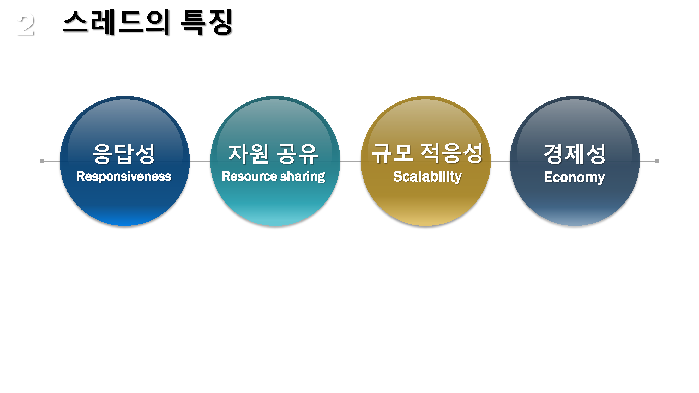
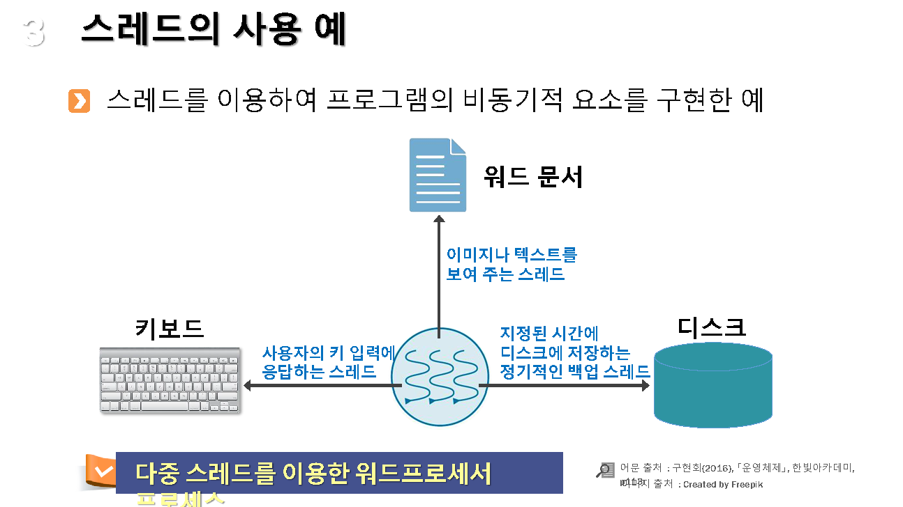
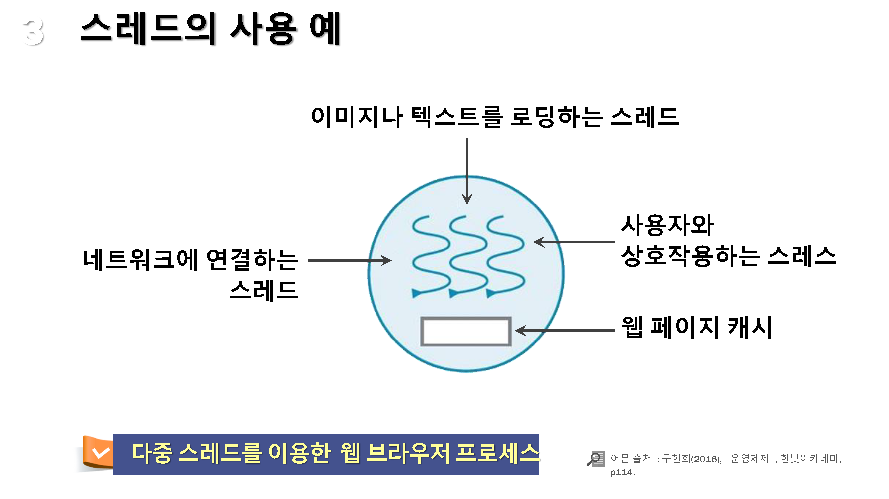
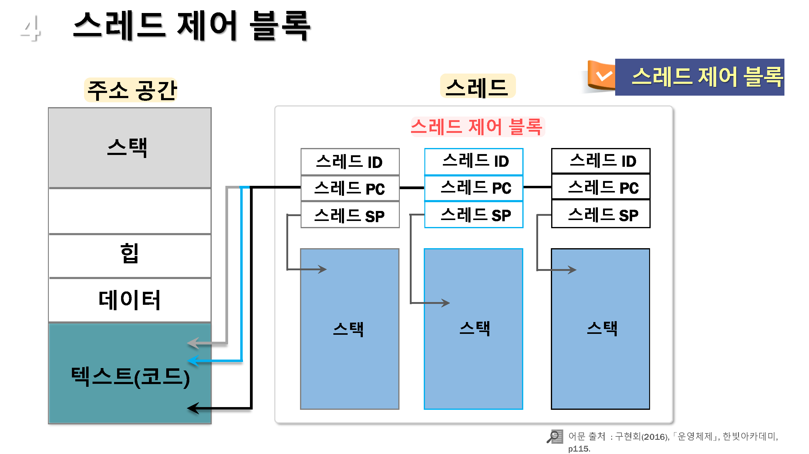

# 스레드의 개념
---

* 스레드의 개념
* 스래드의 특징
* 스레드의 사용 예

* 스레드 제어블럭

## 01. 스레드의 개념

#### 스레드

* 프로세스의 특성인 자원과 제어에서 제어만 분리한 실행단위
  * 스레드들이 코드, 전역 데이터, 힙 등의 많은 `자원을 공유`함
  * 스레드별로 `프로그램 카운터(PC)를 별도록 관리`하여 독립적으로 동작

* 하나의 프로세스를 여러개의 스래드로 나누어서 제어함

## 02. 스래드의 특징

---

#### 응답성(Responsiveness)

* 하나의 프로그램을 다중 스레드로 구현하면 해당 프로그램의 일부 스레드가 동작을 멈추어도 나머지 스레드는 계속해서 수행되어 사용자 응답성이 향상됨

#### 자원공유 (Resource sharing)

* 프로세스의 자원 공유보다 더 많은 종류의 자원 공유가 손쉽게 이루어짐
* 하나의 스레드에서 발생한 문제가 프로세스 전체에 영향을 주고 디버깅이 어려움

#### 규모 적응성(Scalability)

* 복수 개의 CPU를 사용하는 환경에서 각각의 스레드는 별도의 CPU에서 동작 가능하기 때문에 단일 스레드 구조의 프로세스 보다 처리 성능이 향상될 수 있음

#### 경제성 (Economy)

* 프로세스 생성은 스레드 생성보다 더 많은 비용을 필요로 함
* (솔라리스 운영체제에서의 측정결과) 프로세스 생성 시간이 스레드 생성 시간보다 30배 많이 소요됨. 그리고, 프로세스간 전환 시간이 스래드 전환 시간보다 5배 많이 소요됨

## 03. 스레드의 사용 예

---

#### 워드프로세서

* 복수 개의 서로 다른 동작이 동시에 수행되어야 하는 경우
* 그래픽 담당, 키보드 입력 처리, 자동 저장, 철자/문법 검사등

#### 웹 서버

* 하나의 프로세스가 여러 개으 비슷한 작업을 수행하는 경우
* 웹 서버에 연결되는 클라이언트 별로 독립 스레드를 동작

#### 다중 스레드를 적용해서 얻는 이점

* (응답성과 규모 적응성 측면) 다중 스레드를 사용하면 해당 프로그램의 `처리 성능을 향상`시킬 수 있음
* 단일 스레드 구조보다 구현이 쉽고, 스레드 별로 동작 검증할 수 있기 때문에 디버깅도 용이함

## 04. 스레드 제어블럭

---

