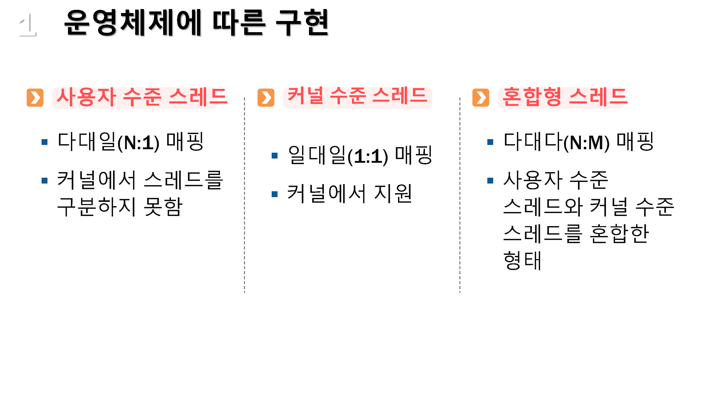

# 스래드의 구현
---

* 운영체제에 따른 구현
* 사용자 수준 스레드
* 커널 수준 스레드

## 01. 운영체제에 따른 구현

## 02. 사용자 수준 스레드

* 사용자 영역의 스레드 라이브러리로 구현학, `모든 행위를 사용자 영역에서 수행`함

* 스레드 교환에 커널이 개입하지 않아서 커널과 사용자 영역간의 `문맥 전환이 불필요`함

* 커널은 프로세스 단위로 관리하며 스레드를 인긱하지 못함

  

#### 장점

* 이식성 높은 : 커널에 독립적으로 스케줄링 수행
* 오버해드 적음 : 커널과의 문맥 교환이 없음
* 유연한 스케줄링 : 커널에서 관여하지 않고 응용 프로그램에 맞게 스케줄링을 할 수 있음

#### 단점

* 시스템의 동시성을 지원하지 않음 : 커널에서 프로세스 단위로 스케줄링 하기 때문에 다중 처리 환경이 갖추어져도 하나의 스레드가 대기 상태가 되면 다른 스레드도 실행 불가함
* 확장의 제약성 : 다중 처리 시스템으로 규모 확장이 어려움
* 스레드간 보호 불가능 : 커널이 아니라 스레드 라이브러리에서 스레드를 보호해야 함

## 03. 커널 수준 스레드

* 커널이 스레드와 관련된 모든 작업을 관리
* 스레드간의 스케줄링시 커널이 관여하여 문맥교횐이 발생
* 커널의 지원으로 효과적이고 안정적인 지원이 가능하지만, 커널에서 스레드 정보를 관리해야 하는 부담과 오버해드가 발생함
* 동일 프로세스 내의 한 개 스레드가 대기 상태여도 다른 스레드는 실행 가능함
* 대부분의 운영체제가 커널 수준 스레드를 지원하거나 지원하는 방향으로 나아가고 있음

## 04. 혼합형 스레드

---

* 사용자 수눈 스레드와 커널 수준 스레드의 혼합된 구조
* 스레드 라이브러리가 최적의 성능을 지원하도록 커널이 스레드 개수를 동적으로 조절
* 커널에서 병렬 처리 정보를 결정할 수 있음

