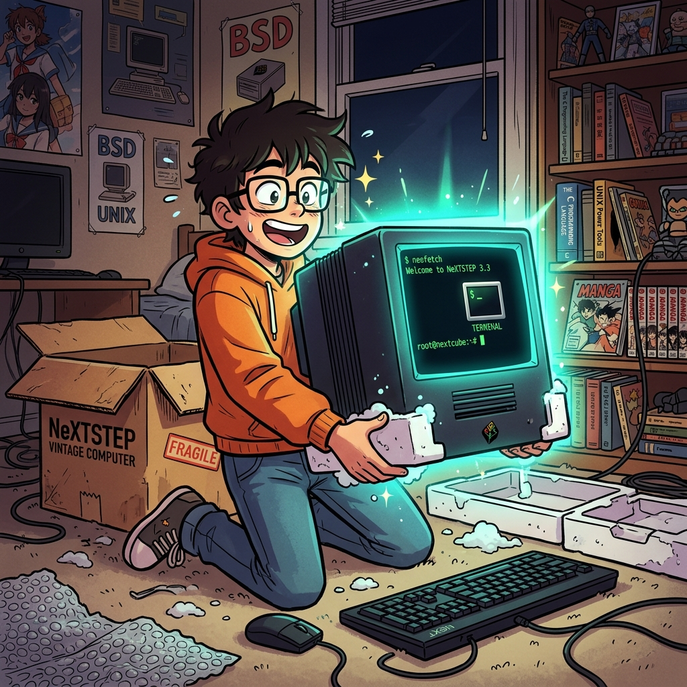
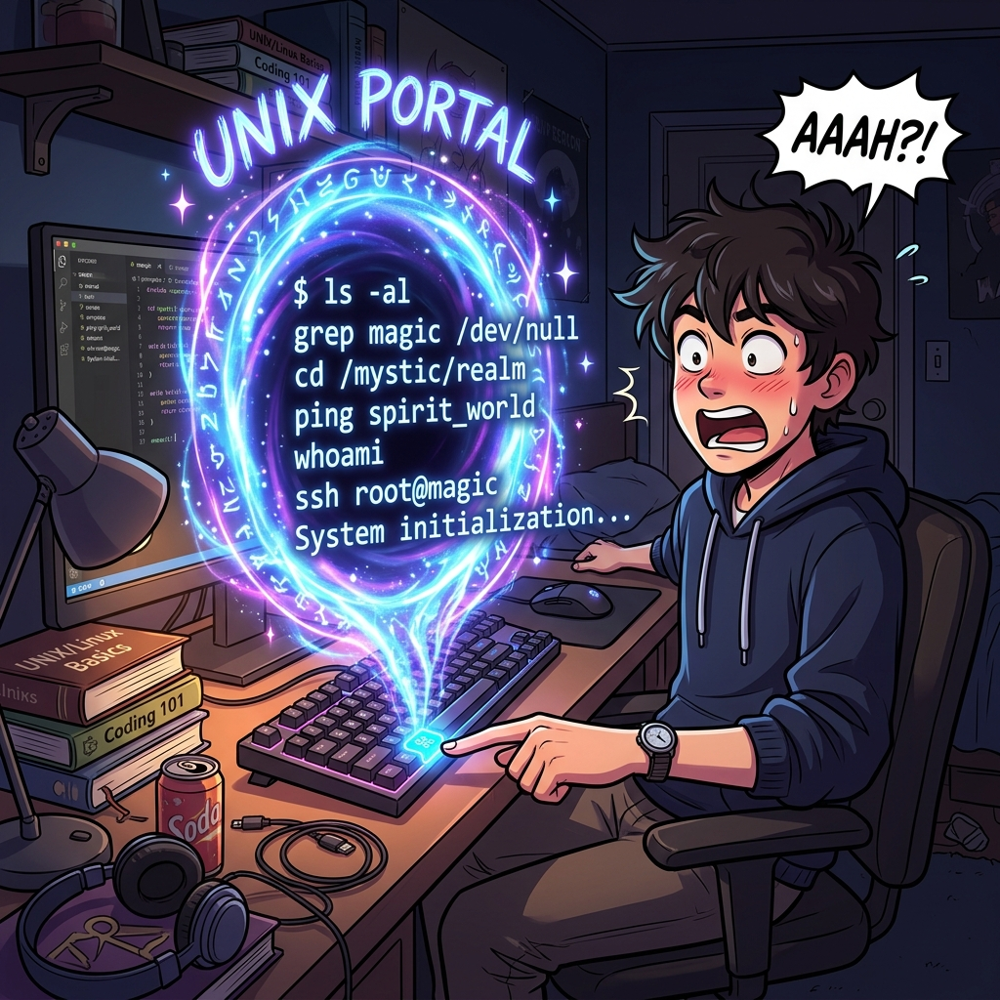

  

  <svg width="100%" height="200" viewBox="0 0 600 200" xmlns="http://www.w3.org/2000/svg"><rect width="100%" height="100%" fill="#1E1E1E" rx="10"/><rect x="250" y="50" width="100" height="100" fill="#333" rx="50"/><text x="300" y="105" fill="white" font-size="18" font-family="monospace" text-anchor="middle">Mach Kernel</text><circle cx="200" cy="100" r="40" fill="none" stroke="#E81123" stroke-width="4"/><text x="200" y="105" fill="#E81123" font-size="14" font-family="monospace" text-anchor="middle">BSD</text><circle cx="400" cy="100" r="40" fill="none" stroke="#0078D7" stroke-width="4"/><text x="400" y="105" fill="#0078D7" font-size="14" font-family="monospace" text-anchor="middle">I/O Kit</text><text x="300" y="30" fill="#00FF00" font-size="16" font-family="monospace" text-anchor="middle">XNU (X is Not Unix) Architecture</text></svg>

# 1주차: macOS의 기원과 터미널 기초 (Darwin, 단축키)

 

## 1. macOS, 단순한 예쁜 껍데기가 아니다

[실전 심화 렉처]
애플의 macOS는 디자이너들만의 장난감이 아닙니다. 그 심장부(XNU 커널)는 철저한 POSIX 규격을 획득한 '리눅스와 사촌격인 순도 100% UNIX 시스템'입니다.
윈도우 개발자들이 리눅스 명령어를 쓰기 위해 파티션을 나누거나 가상머신을 돌려야 할 때, 맥 유저들은 기본 터미널만 열면 그곳이 곧바로 리눅스 서버와 똑같은 `bash/zsh` 환경이 됩니다. 

## 2. 생산성의 극대화

[실전 심화 렉처]
마우스를 쓰지 마십시오. 엔지니어의 코딩은 키보드 위에서 끝납니다.
Command(Cmd) 키는 윈도우의 Ctrl 과 다릅니다. 유닉스 철학을 따라 Control(Ctrl) 키는 터미널 시그널 전송으로 남겨두고, 시스템 UI 체계는 Command 로 분리한 천재적 설계 덕분에 터미널 작업 중 헷갈리지 않습니다.

---

  

  <svg width="100%" height="200" viewBox="0 0 600 200" xmlns="http://www.w3.org/2000/svg"><rect width="100%" height="100%" fill="#1E1E1E" rx="10"/><text x="300" y="80" fill="#00FF00" font-size="24" font-family="monospace" text-anchor="middle">⌘ (Command) vs ^ (Control)</text><text x="300" y="120" fill="gray" font-size="16" font-family="monospace" text-anchor="middle">History of NeXTSTEP Keyboard Mapping</text></svg>

## [심화 렉처] macOS의 심장, XNU 커널

애플의 데스크톱 환경은 단순한 GUI 껍데기가 아닙니다. 내부적으로 Darwin이라는 고도화된 하이브리드 커널 환경(XNU)을 갖추고 있습니다. 스티브 잡스가 NeXT 컴퓨터 시절에 개발한 Mach 마이크로 커널 코드와 FreeBSD 기반 유닉스 서버 유저랜드 코드를 섞어 놓았으며, 이것이 전 세계 개발자들이 맥을 사랑하는 첫 번째 이유가 되었습니다.
POSIX 호환 표준 명령어를 완벽히 사용 가능하면서도 충돌 없는 그래픽 레이어를 제공합니다.

  <svg width="100%" height="120" viewBox="0 0 600 120" xmlns="http://www.w3.org/2000/svg"><rect width="100%" height="100%" fill="#1E1E1E" rx="10"/><text x="300" y="65" fill="#E81123" font-size="18" font-family="monospace" text-anchor="middle">Terminal.app: UNIX Foundation on Desktop</text></svg>

## [심화 렉처] 유닉스 시스템의 조작 철학

Command(⌘) 키는 본래 LISP 환경과 Unix 환경에서 Control 키의 과도한 중복 바인딩을 피하기 위해 설계되었습니다. 터미널에서는 오로지 방향키 없이 Control + a, e 패러다임으로 편집하며, 이는 Emacs 텍스트 에디터의 표준 움직임을 따르고 있습니다. 손을 키보드 홈 로우에서 떼지 않는 것이 생산성 극대화의 기초입니다.
