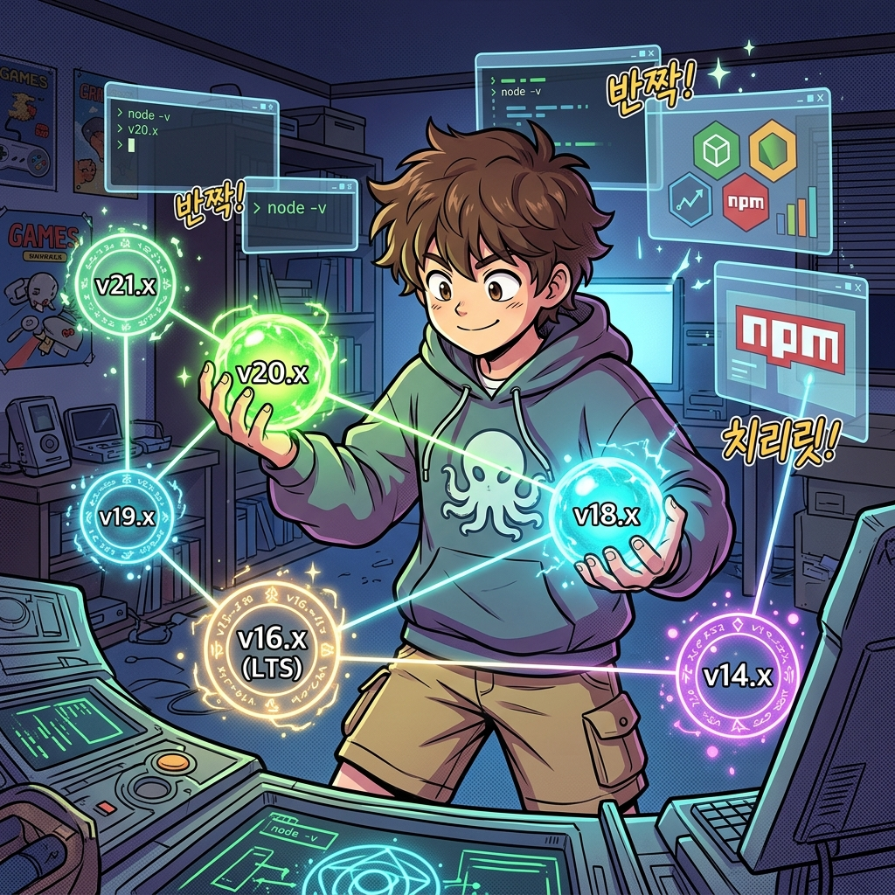

  <svg width="100%" height="200" viewBox="0 0 600 200" xmlns="http://www.w3.org/2000/svg"><rect width="100%" height="100%" fill="#1E1E1E" rx="10"/><rect x="50" y="60" width="150" height="80" fill="#005A9E" rx="5"/><text x="125" y="105" fill="white" font-size="16" font-family="monospace" text-anchor="middle">fnm use 18</text><path d="M 210 100 L 390 100" stroke="#00FF00" stroke-width="4"/><rect x="400" y="60" width="150" height="80" fill="#E81123" rx="5"/><text x="475" y="105" fill="white" font-size="16" font-family="monospace" text-anchor="middle">node -> v18.15.0</text><text x="300" y="90" fill="#00FF00" font-size="14" font-family="monospace" text-anchor="middle">Shim Injection</text></svg>

# 4주차: 멀티 버전 매니저 1 (Node.js & Python)

 

## 1. NVM / FNM 런타임 독립 체계

[실전 심화 렉처]
여러분이 `sudo npm install -g` 로 깐 적이 있다면 당장 맥을 포맷해야 합니다! NVM(Node Version Manager)이나 초고속 Rust 패키징 매니저 FNM은 여러분의 홈 폴더 하위에 버전별 노드를 다운받아 벽을 칩니다.

## 2. Pyenv와 Python의 지옥 탈출기 

[실전 심화 렉처]
기본 설치된 `python3`는 맥 내부 시스템 구동을 위해 존재합니다. `pyenv` 를 도입하여 파이썬 인터프리터 자체를 가로채기(Shim) 하십시오. 그리고 반드시 `venv` 로 샌드박스를 구축해야 합니다.

---

  

  <svg width="100%" height="200" viewBox="0 0 600 200" xmlns="http://www.w3.org/2000/svg"><rect width="100%" height="100%" fill="#1E1E1E" rx="10"/><text x="300" y="100" fill="#00FF00" font-size="20" font-family="monospace" text-anchor="middle">python3 -m venv .venv</text></svg>

## [심화 렉처] NVM과 FNM의 가상화 원리

Node.js를 공식 홈페이지에서 `.pkg` 로 설치하면, `/usr/local/bin` 영역이 오염되어 권한 문제(sudo npm install)에 가로막힙니다. FNM(Fast Node Manager)은 가상의 포인터(Shim) 경로를 만들어, `node` 라고 칠 때 폴더별로 버전 번성한 진짜 런타임을 동적으로 가로채(Intercept) 연결해 줍니다.

  <svg width="100%" height="120" viewBox="0 0 600 120" xmlns="http://www.w3.org/2000/svg"><rect width="100%" height="100%" fill="#1E1E1E" rx="10"/><text x="300" y="65" fill="#E81123" font-size="18" font-family="monospace" text-anchor="middle">source .venv/bin/activate</text></svg>

## [심화 렉처] Python 가상환경 샌드박싱

macOS는 버전에 따라 자체적인 백그라운드 스크립트로 Python 3를 파티션 일부에 내장하고 있습니다. 하지만 사용자가 여기에 `pip install` 로 글로벌 시스템을 더럽혀서는 절대 안 됩니다. `pyenv` 와 `venv` 모듈을 연계하여 내 프로젝트 디렉토리 내부에서만 허락된 격리 Python 환경을 복제(`~/.pyenv/`)하는 기법을 마스터합니다.
