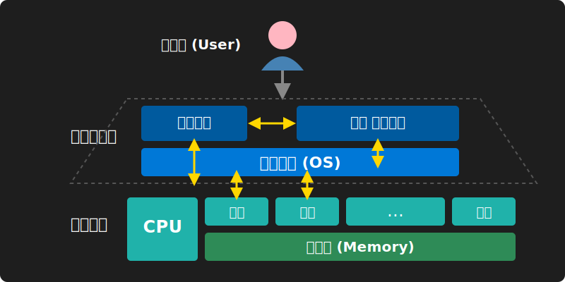
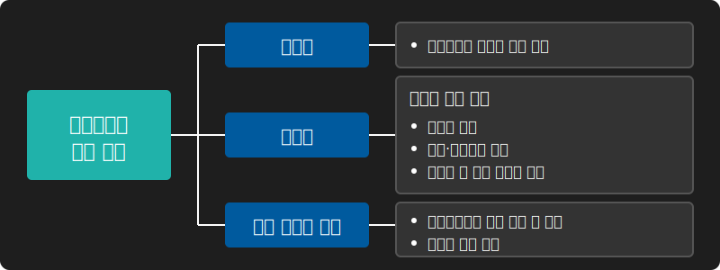

# 1. 컴퓨터 시스템의 구성 요소와 운영체제의 역할

운영체제는 하드웨어를 직접 제어하는 복잡한 작업을 추상화하여, 응용 프로그램과 사용자에게 편리한 인터페이스를 제공하는 소프트웨어 계층(Layer)의 핵심입니다.

## 🧩 운영체제의 브리지 파이프라인

사용자는 응용 프로그램이나 유틸리티를 통해 명령을 내리면, 이 소프트웨어들은 커널(운영체제)에 시스템 호출(System Call)을 보내 하드웨어 자원(CPU, 메모리, 주변 장치 등)을 할당받거나 제어하게 됩니다. 즉, **운영체제는 하드웨어와 응용 프로그램 사이의 강력한 중재자 브리지** 역할을 합니다.

## 🎯 운영체제의 발전 목적

초기 시스템에서 현대적 시스템으로 나아가며 운영체제가 추구한 핵심 목적은 크게 **편리성**, **효율성**, **제어 서비스 향상** 3가지로 압축됩니다.

시스템 자원을 여러 사용자와 프로그램이 충돌 없이 공정하게 사용할 수 있도록 효율적으로 분배하는 것이 현대 운영체제 성능의 척도입니다.
