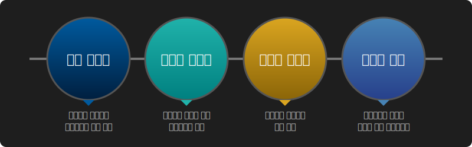
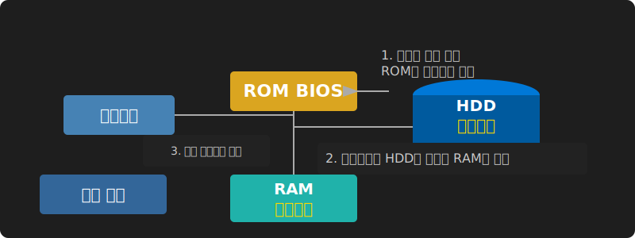

# 2. 운영체제의 핵심 기능과 4대 서비스

운영체제의 주요 기능은 크게 한정된 자원을 통제하는 **자원 관리(Resource Management)**와 시스템 자체를 유지하는 **시스템 관리(System Management)** 영역으로 세분화됩니다.

이러한 핵심 기능들은 사용자 및 애플리케이션 입장에서 다음과 같이 **4가지 주요 서비스 단계**로 추상화되어 제공됩니다.

## 1단계: 부팅 서비스 (Bootstrapping)
컴퓨터의 전원이 켜지면 하드웨어 통제권을 확보하고 운영체제를 메모리에 올리는 시동 과정을 거칩니다. ROM BIOS에서 시작된 제어권은 커널로 이관되어 장치를 초기화합니다.

## 2/3단계: 사용자 & 시스템 서비스 통합 관리
* **시스템 서비스**: 프로세스 스케줄링, 메모리 할당, I/O 제어 등 컴퓨터 시스템의 효율적인 내부 동작을 보장.
* **사용자 서비스**: 터미널 GUI나 명령어 쉘(CLI)을 통해 사용자가 편리하게 작업을 수행하도록 인터페이스 제공.

## 4단계: 시스템 호출 (System Call)
운영체제의 권한이 필요한 핵심 제어 기능을 응용 프로그램이 요청할 수 있도록 제공하는 공개 API(인터페이스) 계층입니다. 애플리케이션은 반드시 시스템 호출을 통해 운영체제에 작업을 허락받아야 합니다.

