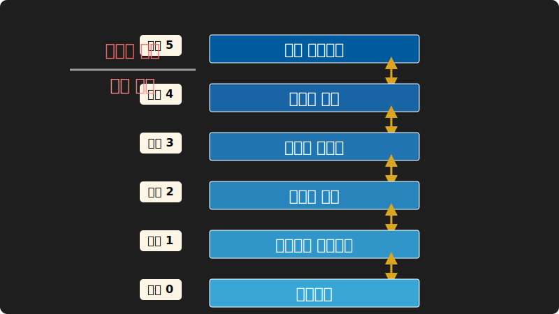

# 3. 운영체제의 시스템 아키텍처와 커널 권한

## 🛡️ [전공 심화] 커널 권한과 링 모델 (Ring Model)

많은 초보자들이 착각하는 것은 '운영체제 = 윈도우 UI 화면'이라고 생각하는 점입니다. 하지만 시니어 엔지니어링 레벨에서 바라보는 OS는 **[추상화, 자원 중재, 권한 제어]** 시스템의 집약체입니다.

모든 사용자 애플리케이션(브라우저, 게임, 파이썬 스크립트)은 **Ring 3(User Mode)** 에서 동작합니다. 하지만 이들은 절대 물리적 메모리나 하드디스크에 직접 데이터를 쓸 수 없습니다. 모든 하드웨어 제어는 **Ring 0(Kernel Mode)** 가 독점하며, 우리는 반드시 OS에게 '문서를 프린트해 주세요', '네트워크로 패킷을 보내주세요'라고 시스템 호출을 부탁해야만 합니다.

이러한 강력한 격리(Isolation)와 추상화(Abstraction)가 없었다면, 구동 중인 프로그램에 버그가 날 때마다 컴퓨터는 완전히 블루스크린을 띄우거나 전원이 차단되었을 것입니다. 하드웨어는 결국 0과 1의 전기 신호일 뿐입니다. 운영체제의 가장 위대한 발명은 이 전선을 '파일'이라는 개념으로, 트랜지스터 연산을 '프로세스'라는 개념으로 논리적으로 감싸 올렸다는 것입니다.

<br>

## 🏗️ 시스템 아키텍처: 모놀리식 vs 마이크로

소프트웨어 공학의 발전에 따라 복잡한 커널과 시스템 코드를 구조화하는 방법론 또한 발전했습니다. 대표적인 커널 아키텍처는 다음과 같습니다.

### 단일 / 모놀리식 구조 (Monolithic Structure)
운영체제의 모든 핵심 기능이 단일 커널 공간 안에 위치하는 구조입니다. 컴포넌트 간 통신 속도가 빠르지만, 단일 버그가 전체 시스템을 패닉에 빠뜨릴 수 있습니다. (Linux 커널이 대표적인 모놀리식입니다.)


### 계층 구조 (Layered Structure)
하드웨어를 최하단 '계층 0'으로 두고 상위 계층으로 갈수록 응용 친화적 인터페이스로 추상화시키는 구조입니다. 철저히 모듈화되어 디버깅은 매우 수월하지만 잦은 계층 간 API 호출로 인한 레이턴시 비용이 발생합니다.



### 마이크로커널 구조 (Microkernel Structure)
가장 원초적인 뼈대인 IPC 모듈과 메모리 관리만 커널 모드에 집중시키고, 파일 시스템이나 드라이버 등 대부분을 **사용자 모드(User Mode)**로 밀어낸 현대적 아키텍처입니다. 높은 이식성과 견고한 안정성이 돋보이며, 자동차 OS나 실시간 OS(RTOS)에서 선호됩니다.


### 💡 [실전 심화] 현대 OS 생태계 실태
엔지니어라면 현재 내 커널이 어떻게 구축되어 있는지 파라미터를 읽을 줄 알아야 합니다.
```bash
$ uname -r         # 현재 기동중인 커널 버전 확인
$ dmesg | head -10 # 부팅 시 적재된 커널 모듈 로그 확인
```
