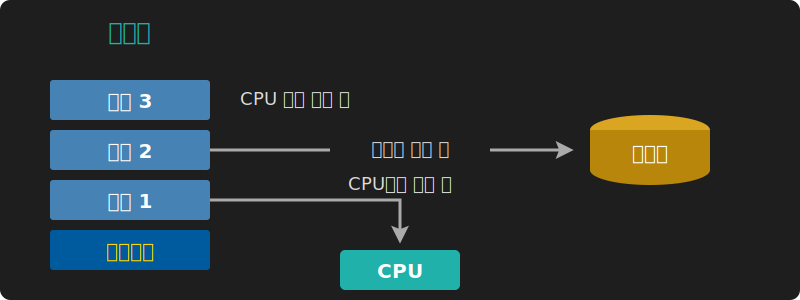
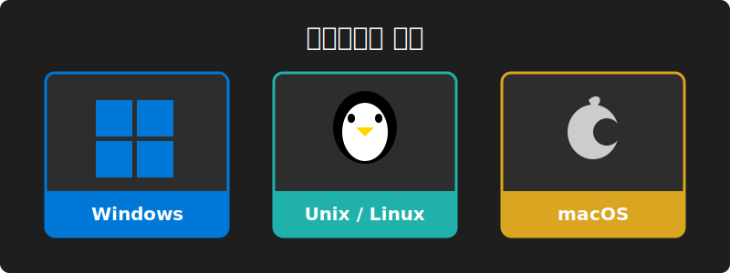
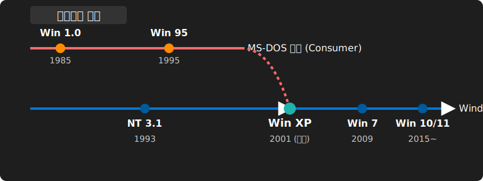

# 4. 운영체제의 발전사 및 시스템 계보도

초창기 단순 명령어 로더(Loader)의 역할에 불과했던 OS는 시대별 트랜지스터(CPU) 요구량에 발맞추어 비약적으로 발전했습니다.

## ⏳ 운영체제의 유형 발전

1. **일괄 처리(Batch Processing)**: 입력 데이터를 일정 기간/양만큼 모은 후 한꺼번에 계산을 돌립니다.
2. **다중 프로그래밍(Multiprogramming)**: CPU가 I/O 대기시간을 갖는 동안 버려지는 유휴 사이클을 활용하기 위해, 메모리에 다중 작업(Job)을 올려 전환 속도를 높였습니다.

3. **시분할(Time-sharing)**: CPU 시간을 Time-slice 쪼개 수많은 사용자별 대화형 응답을 보장합니다.
4. **다중 처리(Multiprocessing)**: 둘 이상의 프로세서를 장착하여 강력한 스루풋을 도출합니다.
5. **분산 처리(Distributed)**: 고속 네트워크를 토대로 격리된 연산 노드들을 묶어 가용성을 끌어올린 엔터프라이즈 마이크로서비스 클러스터 모델입니다.

### 💡 [전공 심화] 멀티유저와 권한 분리의 실무적 단면
Unix가 탄생한 1970년대, 컴퓨터는 집 십여 채만 한 크기의 메인프레임이었습니다. 수백 명의 연구원이 모니터(터미널)만 연결해 하나의 CPU 자원을 시분할(Time-Sharing)하여 사용해야 했기에, 서로의 파일을 간섭하지 못하게 하는 **'유저 권한 식별(UID)' 메커니즘**이 설계의 기저에 잡혀있습니다.

이 구조는 오늘날까지 이어져 `who`, `w`, `last` 명령어는 단순 로그인 로그가 아니라 현재 터미널이 어떤 `pts` 포트에 매핑되어 어떻게 격리되었는지 시스템 상태를 철저히 관리합니다.

 

## 💻 운영체제의 종류 (Windows / Unix / Linux)

### Microsoft Windows

* **1990년대 (Windows 95/NT)**: 기업용 서버시장을 위해 만들어진 NT 커널 아키텍처가 훗날 Windows 체계를 통합하는 뼈대가 되었습니다.
* **2000년대 이후 (Windows XP ~ Windows 11)**: 안정성 높은 NT 커널 기반으로 현재는 구독형 클라우드 서비스로서의 OS (OSaaS) 모델로 진화했습니다.

### Unix 및 Linux

* **BSD 계열**: 버클리 대학교에서 시작된 학술/오픈소스 중심의 배포판입니다. 우리가 사용하는 Apple의 macOS 역시 FreeBSD 계보의 오픈소스 커널(XNU/다윈)을 씁니다.
* **Linux (리눅스)**: 리누스 토르발스가 제작한 완전한 독립형 오픈소스 커널로, 내부 구조는 유닉스와 호환되지만 코드를 공유하지 않는 현대 IT 생태계의 패자입니다.
