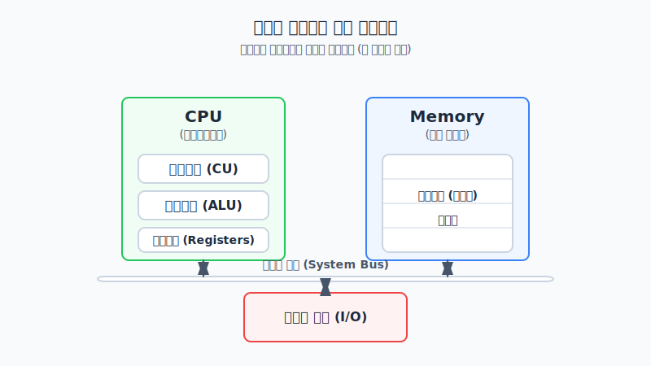
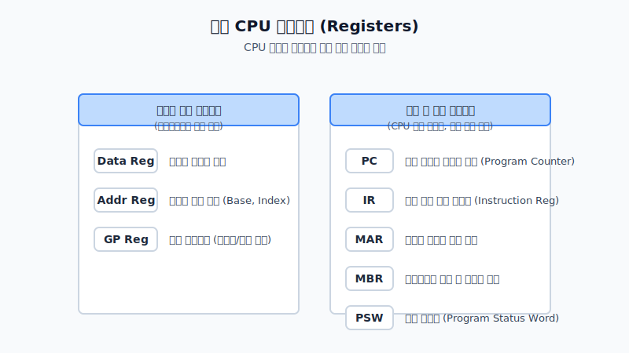

# 1. 기초 아키텍처: 폰 노이먼 구조와 CPU 딥 다이브

현대의 범용 시스템은 프로그램 코드와 데이터가 메인 메모리에 디지털 형태로 적재되어 순차적으로 해석되는 **내장형 프로그램 명령(Stored-program concept)** 구조 즉, 폰 노이먼 아키텍처를 근간으로 합니다.

모든 디지털 연산의 두뇌 역할을 하는 **CPU(중앙처리장치)**는 논리적으로 세 가지 핵심 모듈로 나뉩니다.

1. **제어 장치 (Control Unit, CU)**: 명령어의 옵코드를 디코딩하여 시스템 부품에 제어 신호(타이밍 펄스)를 발령하는 마이크로 스케줄러입니다.
2. **산술 논리 연산 장치 (ALU)**: 산술 연산 및 비트 마스킹 메커니즘을 책임지는 조합 논리 회로 체계입니다.
3. **레지스터 세트 (Registers)**: CPU 다이(Die) 내부에 내장된, 시스템에서 가장 빠른 임시 캐시 공간입니다.

특히 운영체제 루틴이 상호작용하기 위해서는 다음의 **특수 목적 레지스터**의 용도를 정확히 파악해야 합니다.

명령어가 존재하는 공간의 위치를 지정하는 **PC(Program Counter)**, 인터럽트와 시스템 권한 모드(Kernel/User)를 관리하는 **PSW(Program Status Word)** 등은 차후 다룰 프로세스 컨텍스트 스위칭의 핵심 뼈대입니다.

 

## 🚀 파이프라이닝과 명령어 사이클 구조

가장 기저 단위인 명령어 파이프라인으로 내려가 봅시다.
모든 x86이나 ARM 바이너리는 연산 작업(Opcode)과 메모리 주소(Operand) 배열 형태의 구조체입니다. 이것을 끌고 오는 **인출(Fetch) 사이클**은 나노 스케일의 마이크로 연산을 포함합니다.

현대 프로세서 설계의 꽃은 인출(IF), 디코드(ID), 실행(EX), 결과 쓰기(WB) 스텝을 병렬 오버랩 처리하는 **파이프라이닝(Pipelining)**입니다. 이를 통해 RISC 아키텍처는 클럭당 명령어 사이클 처리량을 극대화하는 슈퍼스칼라 성능을 구가합니다.

