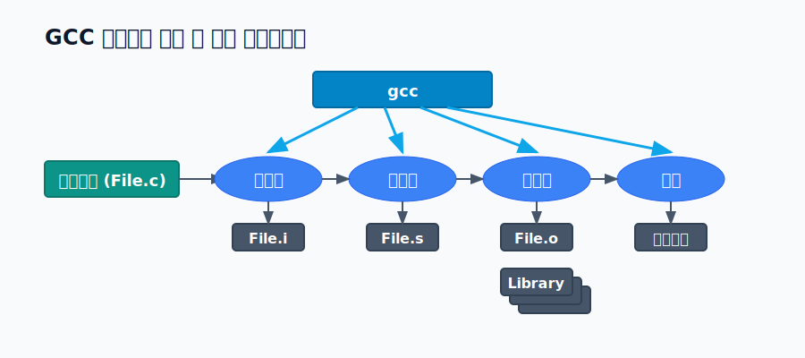

# 4. (별첨) 시스템 프로세스 개발과 GCC 컴파일링 파이프라인

시스템 커널 개발, 드라이버 제작 및 엔지니어링 수준의 프로그램 이식성 디버깅 시에는 로우 레벨 빌드 아키텍처를 완벽하게 추적할 수 있어야 합니다.

리눅스의 표준 인프라 컴파일러인 **GCC (GNU Compiler Collection)**는 단순히 버튼을 눌러 실행 파일을 내뱉는 도구가 아니라 크게 4개의 고유한 파이프라인(Pipelining) 단계로 체계적 변역을 거칩니다.

단순해 보이는 `gcc main.c` 명령어 내부는 백그라운드에서 철저히 하위 모듈들로 이양되어 처리됩니다:
1. **전처리(Preprocess / `cpp`)**: 제일 먼저 가동됩니다. `macros.h` 같은 헤더 파일의 소스 코드를 복사해서 그대로 문서를 합치고, 주석 등을 파기하는 `.i` 확장자의 임시 텍스트 데이터를 형성합니다.
2. **컴파일(Compile / `cc1`)**: 핵심 엔진입니다. 전처리된 C 코드를 문법 파싱 및 링킹 최적화를 거쳐 인간 친화적 텍스트 기반 **어셈블리어(.s)**로 산출합니다.
3. **어셈블(Assemble / `as`)**: 텍스트로 된 어셈블리 니모닉 명령들을 직접 기계 CPU만이 알아들을 수 있는 0과 1 배열인 네이티브 목적 파일(Object File, `.o`) 기계어로 1:1 파싱합니다.
4. **링크(Link / `ld`)**: 여러분이 작성하지 않았던 `printf` 같은 함수가 구현된 시스템 I/O 라이브러리(`libc`) 객체 파일들을 현재 목적 파일과 연결자(Linker)를 통해 정적/동적으로 병합하여, 최종 타겟 시스템(OS) 전용 **단일 논리 실행 바이너리(Executable)** 포맷인 ELF 헤더 파일로 치환해냅니다.
