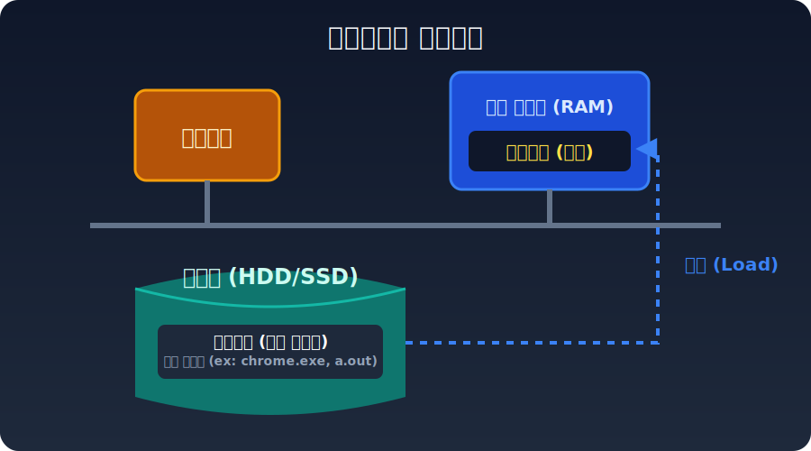
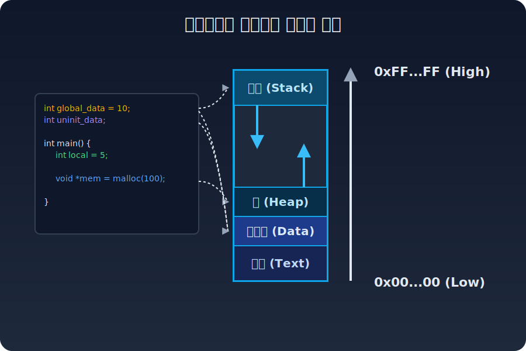

# 1. 프로세스와 코어 메모리 구조

디스크에 저장되어 있는 실행 파일 자체는 스스로 연산할 수 없는 정적인 **프로그램(Program)**에 불과합니다. 사용자가 터미널 CLI 컴포넌트에서 `python main.py` 나 `./a.out`을 치면, 커널(OS)이 디스크 공간에 있던 코드를 메인 메모리(RAM)로 끌어올려 능동적인 추적 개체인 **프로세스(Process)**로 생명력을 불어넣습니다.

커널이 프로그램을 프로세스로 승격시킬 때, 프로세스는 시스템으로부터 완벽하게 격리된 독자적인 가상 메모리 세그먼트를 쥐어 받습니다. 

이 메모리 레이아웃은 4가지 파트로 뚜렷하게 나뉩니다:
* **Code (Text)**: 작성해 둔 코드 비즈니스 로직 패턴이 불변의 형태(Read-Only)로 적재된 기계어 및 상수 공간.
* **Data**: 프로그램이 실행되는 내내 유지되는 전역 변수 및 정적(Static) 라이프사이클 변수 공간.
* **Heap / Stack**: 메모리의 중앙 공간을 위아래로 다이나믹하게 나눠 쓰는 가변 런타임 공간입니다. 
  - `malloc`이나 객체 `new` 선언 영역은 힙(Heap)에서 윗단으로 자랍니다.
  - 함수 호출의 매개변수와 로컬 변수는 스택(Stack) 영역에서 하단으로 역참조해 자라납니다.
