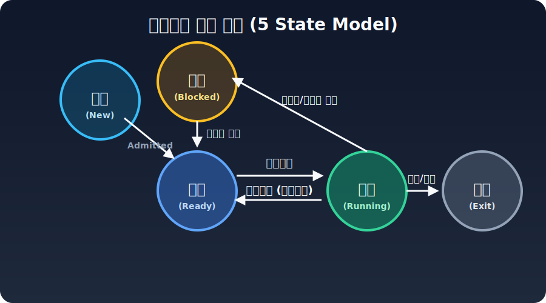
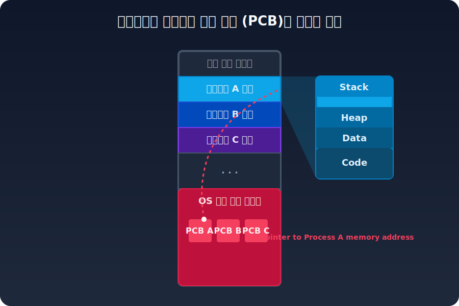

# 2. 프로세스 제어 블록(PCB)과 생명 주기 시스템

메모리 상에서 활성화되었다 하더라도, 당장 CPU의 제어권을 얻지 못하면 프로세스는 멈춘 것과 같습니다. 운영체제는 수만 개의 프로세스를 통제하기 위해 **5상태 및 7상태(중단 포함)** 모델에 따라 준비 큐(Ready Queue)와 대기 큐(Wait Queue) 사이를 이동시킵니다.

프로세스는 큐 시스템에서 상태가 실시간으로 변동합니다. 커널은 이러한 상태 이동을 완벽하게 기억하고 추적하기 위해 OS 커널 보호 구역 메모리 안에 1:1로 매핑되는 정밀한 관리명부인 **PCB (Process Control Block)** 구조체를 상주시켜 둡니다.

여기에는 PID 식별 번호, 현재 프로세스가 마지막으로 실행 중이던 Program Counter 라인 번호, 그리고 CPU에 올려두었던 모든 범용 레지스터 스냅샷 덤프 정보가 낱낱이 저장됩니다.

### 무거운 짐, 문맥 교환 (Context Switching)

운영체제가 프로세스 A의 타임 슬라이스가 종료되었다고 판단하여 프로세스 B에게 CPU를 양보할 때, 이 통제권 전환 현상을 **문맥 교환(Context Switching)**이라 부릅니다. 

하지만 이 오버헤드 전환 시간 동안 CPU의 연산 코어는 쓸모없는 계산기를 일시 정지당한 채 PCB 레지스터 덤프를 커널로 올리고 새 PCB 정보를 내려받는 지연 낭비만을 겪게 되므로 과도한 스위칭은 자제되어야만 합니다.
