# 1. 프로세스 버스트 패턴과 스케줄러 3계층 아키텍처

한 번에 한 가지 연산밖에 못 하는 싱글/멀티 코어 CPU가 수백 개의 프로그램을 '동시에' 돌리는 것처럼 속일 수 있는 비결은 운영체제의 민첩한 감시와 할당 덕분입니다. 이를 세팅하기 위해선 프로세스의 삶이 단순한 반복임을 파악해야 합니다.

## CPU 버스트와 I/O 버스트
프로세스의 논리적 라이프사이클은 결국 **CPU 버스트(코어 수학 연산 로직)**와 **입출력 버스트(디스크 저장/네트워크 로딩 대기)**의 끊임없는 왕복입니다.

실제 통계를 내어보면 대부분의 프로세스는 극도로 짧은 CPU 버스트를 가지며 잦은 입출력을 발생시킵니다 (I/O Bound). 이 짧은 CPU를 최대한 쉴 새 없이 돌리기 위해 스케줄러 계층이 디자인되었습니다.

## 큐잉 파이프라인과 3대 스케줄러
준비 큐(Ready Queue)와 다양한 장치 대기 큐들은 내부적으로 큐 헤더를 두고 PCB를 링크드 리스트로 연결해 관리합니다. 

이 파이프라인은 3가지 층위(Tier)로 제어됩니다:
* **장기 스케줄러 (Long-term)**: 시스템 부하를 조정하며 디스크에서 메모리로 끌고 올 프로세스 수를 조절함.
* **중기 스케줄러 (Medium-term)**: 메모리 부족 사태 시 우선순위가 낮은 프로세스를 디스크(Swap Area)로 강제로 빼내어 스래싱을 막음.
* **단기 스케줄러 (Short-term / Dispatcher)**: Ready 큐에서 가장 시급한 프로세서의 PCB를 CPU 레지스터에 초고속 스위칭 적재함.
