# 1. 멀티스레드의 악몽: 동시성(Concurrency)과 경쟁 조건

두 스레드가 공유 변수인 공동 계좌 잔고에 동시에 `counter = counter + 1`을 수행했을 때, 1+1이 2가 아니라 1이 될 수 있다는 기상천외한 사실을 이해해야 합니다.

어셈블리 레벨에서 이 고수준 코드 단 한 줄은 `메모리 읽기(Load) -> 더하기(Add) -> 메모리에 쓰기(Store)`의 3단계 마이크로 트랜잭션으로 이루어집니다. 
A 스레드가 수치를 Load를 마친 그 찰나의 티끌 같은 순간에, 하드웨어 타이머가 터지면서 컨텍스트 스위칭이 일어나 B 스레드가 동일한 과거 수치를 파고들어 Load해버리면 양쪽의 연산 중 하나가 덮어씌워져 **정보가 영구적으로 분쇄(Lost Update)**됩니다. 이 현상을 **경쟁 조건(Race Condition)**이라고 부릅니다.

## 해방 공간: 임계 영역(Critical Section) 아키텍처

경쟁 조건을 방지하기 위해, 오직 한순간에 한 놈만 접근을 허락하는 공유 자원 코드 조각 영역을 **임계 영역(Critical Section)**으로 캡슐화합니다.

진입 전 락을 걸고(`Entry`), 작업을 마친 후 락을 풀며(`Exit`), 완벽한 임계 영역 규약을 준수하려면 다음 3가지의 철저한 공학적 조건이 수반되어야 합니다.
1. **상호배제 (Mutual Exclusion)**: 한 놈이 들어갔으면 다른 프로세스는 절대로 진입할 수 없다.
2. **진행 (Progress)**: 아무도 없고 들어가려는 놈들이 있다면, 무한정 미루지 말고 순서를 정해 밀어 넣어야 한다 (교착상태 방어).
3. **한정 대기 (Bounded Waiting)**: 대기표를 뽑은 프로세스는 언젠가 반드시 자기 차례가 와야 한다 (아사/기아 상태 방어).
