# 4. 교착 상태 (Deadlock) 발생 4조건과 회피 모델

동기화 락을 안전을 위해 과다 복용하면 끔찍한 부작용이 도래합니다. A 스레드는 DB 연결 락을 쥔 채 파일 락을 기다리고, B 스레드는 파일 락을 쥔 채 DB 연결 락을 요구하는 영원한 자원 무한 대기 굴레, **교착 상태(Deadlock)**입니다.

현실계에서 데드락이 발생하려면 수학적으로 다음 4가지 요소가 '동시에' 충족되어야만 합니다. 
1. **상호 배제 (Mutual Exclusion)**: 한 놈만 쓰는 배타적 자원인가?
2. **비선점 (No Preemption)**: 남이 가진 자원을 강제로 뺏을 수 없는가?
3. **점유와 대기 (Hold and Wait)**: 자원을 한 개 이상 잡은 채, 남의 것을 요구하는가?
4. **순환 대기 (Circular Wait)**: 물고 물리는 고리 형태(Cycle)를 그리는가?

## 자원할당 그래프 검출과 회피 (Avoidance)

운영체제는 데드락을 스캐닝하기 위해 프로세스(원)와 자원(사각형)의 점유/요구 상태를 연결하는 **방향성 그래프(Resource Allocation Graph)**를 그립니다. 이 그래프 내에서 붉은색 '사이클'이 발견되면 데드락 확률이 극대화됩니다.

### 시스템 회피: 은행원 알고리즘 (Banker's Algorithm)
다익스트라는 데드락 자체를 사전에 막는 회피 기법을 발명했습니다. 시스템을 안전/불안정으로 나누어 자원 요구 최대치 행렬(Matrix)을 시뮬레이션 해보고, 자원을 배분해주었다 가정할 때 한 놈이라도 완전히 시스템을 빠져나갈 **안전 순서(Safe Sequence)**가 존재하지 않으면 애초에 락을 내어주지 않고 대기시킵니다.

### [현대 공학적 결론] 타조 알고리즘 체택과 락 오더링 (Lock Ordering)
은행원 알고리즘은 수학적으로 극도로 아름답지만, 행렬을 매초마다 계산하는 커널 오버헤드가 막대하여 현대 Linux나 Windows는 이를 탑재하지 않고 **'타조 접근법(모래에 머리를 박고 모른 채 무시한다)'**을 씁니다. 그렇기에 오늘날의 데드락 방어는 스케줄러가 아닌 시스템 엔지니어 시스템 설계 레벨의 몫입니다.
* 모든 백엔드 스레드가 무조건 낮은 ID 자원부터 획득하도록 강제하는 **락 오더링(Lock Ordering)** 설계.
* 락을 3초 이상 못 얻으면 스스로 물러나 쥔 락을 다 토해내고 다시 처음부터 시작하는 **타임아웃(Timeout and Retry)** 모델.
