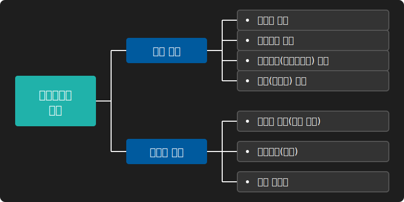
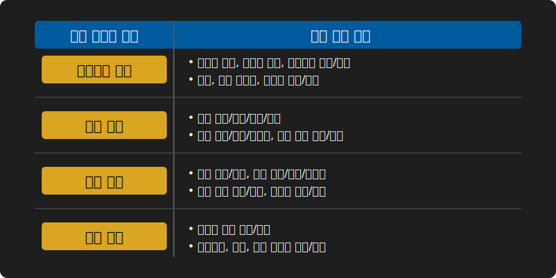
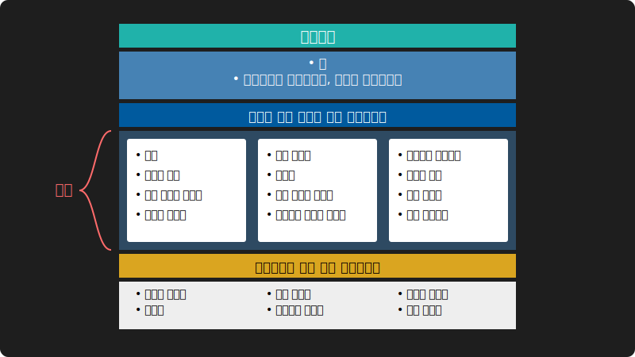
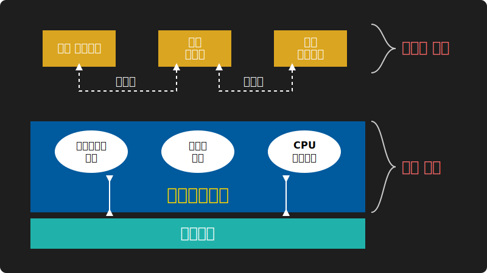
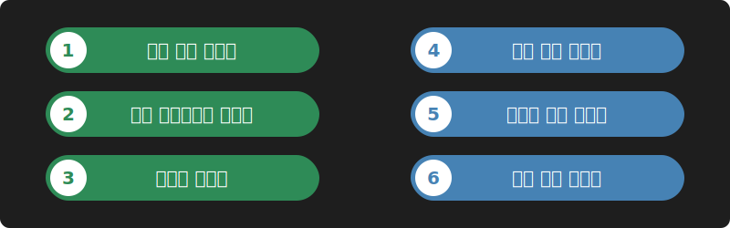
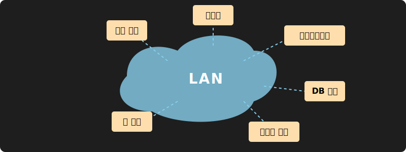

# 1강. 운영체제의 개요

운영체제(Operating System, OS)는 사용자와 컴퓨터 하드웨어 사이의 중재자 역할을 수행하는 가장 핵심적인 시스템 소프트웨어입니다. 본 강의에서는 운영체제의 기본 개념부터 현대적 운영체제의 발전 과정까지 포괄적인 이론을 학습하고, 리눅스 기반의 실습 환경을 구축합니다.

---

## 🎯 학습 목표

* **운영체제의 개념과 목적**을 명확히 설명할 수 있다.
* 운영체제가 제공하는 **핵심 기능과 주요 서비스**를 나열하고 이해한다.
* 시대별 **운영체제의 특성 및 처리 시스템 구조**를 구분할 수 있다.
* **운영체제 아키텍처(Monolithic, Layered, Microkernel)**의 특징을 이해한다.
* 가상 머신(Virtual Machine)을 이용한 **개인 실습 환경(Ubuntu Linux)**을 성공적으로 구축한다.

 

## 🧩 컴퓨터 시스템의 구성 요소와 운영체제의 역할

운영체제는 하드웨어를 직접 제어하는 복잡한 작업을 추상화하여, 응용 프로그램과 사용자에게 편리한 인터페이스를 제공하는 소프트웨어 계층(Layer)의 핵심입니다.

사용자는 응용 프로그램이나 유틸리티를 통해 명령을 내리면, 이 소프트웨어들은 커널(운영체제)에 시스템 호출(System Call)을 보내 하드웨어 자원(CPU, 메모리, 주변 장치 등)을 할당받거나 제어하게 됩니다. 즉, **운영체제는 하드웨어와 응용 프로그램 사이의 두꺼운 중재자 브리지** 역할을 합니다.

### 운영체제의 발전 목적

초기 시스템에서 현대적 시스템으로 나아가며 운영체제가 추구한 핵심 목적은 크게 **편리성**, **효율성**, **제어 서비스 향상** 3가지로 압축됩니다.

 

## ⚙️ 운영체제의 핵심 기능과 4대 서비스

운영체제의 주요 기능은 크게 한정된 자원을 통제하는 **자원 관리(Resource Management)**와 시스템 자체를 유지하는 **시스템 관리(System Management)** 영역으로 세분화됩니다.

이러한 핵심 기능들은 사용자 및 애플리케이션 입장에서 다음과 같이 **4가지 주요 서비스 단계**로 추상화되어 제공됩니다.

### 1단계: 부팅 서비스 (Bootstrapping)

컴퓨터의 전원이 켜지면 하드웨어 통제권을 확보하고 운영체제를 메모리에 올리는 시동 과정을 거칩니다. ROM BIOS에서 시작된 제어권은 커널로 이관되어 장치를 초기화합니다.

### 2/3단계: 사용자 & 시스템 서비스 통합 관리
* **시스템 서비스**: 프로세스 스케줄링, 메모리 할당, I/O 제어 등 컴퓨터 시스템의 효율적인 내부 동작을 보장.
* **사용자 서비스**: 터미널 GUI나 명령어 쉘(CLI)을 통해 사용자가 편리하게 작업을 수행하도록 인터페이스 제공.

### 4단계: 시스템 호출 (System Call)

운영체제의 권한이 필요한 핵심 제어 기능을 응용 프로그램이 요청할 수 있도록 제공하는 공개 API(인터페이스) 계층입니다. **프로세스 제어, 파일 조작, 장치 관리, 정보 보호** 영역에서 전방위적으로 지원됩니다.

 

## 🏗️ 운영체제의 시스템 아키텍처

소프트웨어 공학의 발전에 따라 복잡한 커널과 시스템 코드를 구조화하는 방법론 또한 발전했습니다. 대표적인 커널 아키텍처는 다음과 같습니다.

### 단일 / 모노리틱 구조 (Monolithic Structure)
운영체제의 모든 핵심 기능(스케줄링, 파일시스템, 디바이스 드라이버 등)이 단일 커널 공간(Kernel Space) 안에 위치하는 구조입니다. 컴포넌트 간 통신 오버헤드가 적어 실행 속도가 빠르지만, 단일 버그가 전체 시스템을 패닉에 빠뜨릴 수 있다는 단점이 있습니다. (초기 UNIX)

### 계층 구조 (Layered Structure)
하드웨어를 최하단 '계층 0'으로 두고, 상위 계층으로 갈수록 하드웨어 제어 기능에서 응용 친화적 인터페이스로 추상화시키는 구조입니다. 철저히 모듈화되어 디버깅은 매우 수월하지만 잦은 계층 간 API 호출로 인한 레이턴시 비용이 발생합니다.

### 마이크로커널 구조 (Microkernel Structure)
가장 원초적인 뼈대인 프로세스 모델, 제한된 메모리 관리 체계, 프로세스 간 통신(IPC) 모듈만 커널 모드에 집중시키고, 파일 시스템이나 장치 드라이버 등 대부분의 기능을 OS 서비스 프로세스로 띄워서 **사용자 모드(User Mode)** 로 밀어낸 현대적 아키텍처입니다. 높은 이식성과 견고한 보안성을 확보할 수 있습니다.

 

## ⏳ 운영체제의 유형 발전사

초창기 단순 명령어 로더(Loader)의 역할에 불과했던 OS는 시대별 트랜지스터(CPU) 스펙트럼과 요구량에 발맞추어 비약적으로 발전했습니다.

1. **일괄 처리(Batch Processing)**: 펀치 카드 시대의 모델로 입력 데이터를 일정 기간/양만큼 모은 후 한꺼번에 계산을 돌립니다.
2. **다중 프로그래밍(Multiprogramming)**: CPU가 I/O 대기시간(디스크 연산 등)을 갖는 동안 버려지는 유휴 사이클을 활용하기 위해, 메모리에 다중 작업(Job)을 올려 전환 속도를 높였습니다.

3. **시분할(Time-sharing)**: 다중 프로그래밍의 연장선으로, CPU 시간을 시분할 논리(Time-slice)로 쪼개 수많은 사용자 프로세스를 매우 빠르게 순환시키며, 사용자 관점의 즉각적인 대화형 응답성을 제공합니다.
4. **다중 처리(Multiprocessing)**: 둘 이상의 프로세서를 장착하여 실제 물리적인 병렬 연산을 달성, 강력한 스루풋(Throughput)을 도출합니다.
5. **실시간 처리(Real-time)**: 계산 결과의 정확성만큼이나 '납기 기한 내 반환(Dead-line)'이 치명적인 절대 조건으로 적용되는 결정론적 체계입니다. 우주항공, 심박 조율기 등에 투입됩니다.
6. **분산 처리(Distributed)**: 고속 네트워크의 발전을 토대로 격리된 연산 노드들을 묶어 자원의 병목을 해결하고 가용성을 끌어올린 엔터프라이즈 통합 클러스터 모델입니다.

 

## 💻 운영체제의 종류 및 발전사 (Windows / Unix / Linux)

현대 데스크탑과 서버 시장을 양분하는 주요 운영체제는 크게 마이크로소프트의 Windows와 학술/서버 생태계에서 파생된 Unix/Linux 계열, 그리고 Apple의 macOS로 분류됩니다.

### Microsoft Windows 역사 요약

우리가 접하는 데스크탑 운영체제 인프라를 지배한 **Microsoft Windows**는 처음부터 지금의 모습을 갖추고 있지 않았습니다.

* **1985년 (Windows 1.0)**: 완전히 독자적인 OS가 아니라, MS-DOS 위에서 시각적인 창(Window)을 열게 해주는 그래픽 유틸리티 레이어에 불과했습니다.
* **1990년대 (Windows 95/NT)**: NT는 기업용 서버시장을 위해 만들어진 탄탄한 커널 아키텍처로 훗날 Windows 체계를 통합하는 뼈대가 됩니다. 95는 일반 소비자를 위한 플러그 앤 플레이(PnP)와 대중적인 32비트 GUI 경험을 전파했습니다.
* **2000년대 이후 (Windows XP ~ Windows 11)**: 안정성 높은 NT 커널을 기반으로 불안정했던 DOS 기반을 완전히 버리고 홈/프로페셔널 구분을 합쳤으며, 오늘날에는 서비스로서의 OS (OSaaS) 모델로 체계를 전환하였습니다.

### Unix 및 Linux 계보도

현대 운영체제의 가장 깊은 뿌리인 **UNIX**는 1969년 벨 연구소(Bell Labs)에서 시분할 시스템을 위해 탄생했습니다.

* **System V 계열**: 전통적인 상용 유닉스로 기업 환경에 맞게 강력한 성능을 내도록 커스터마이징된 Solaris, HP-UX, AIX 등이 여기에 속합니다.
* **BSD 계열**: 버클리 대학교에서 시작된 학술/오픈소스 중심의 배포판입니다. 우리가 사용하는 Apple의 macOS 역시 FreeBSD 계보의 오픈소스 커널(다윈)을 채택하고 있습니다.
* **Linux (리눅스)**: 대학교에서 미닉스(Minix)를 다루던 리누스 토르발스가 제작한 완전한 독립형 오픈소스 커널로, 내부 구조는 유닉스와 호환되지만 유닉스 코드를 전혀 포함하지 않은 현대 IT 생태계의 기반이 되었습니다.

 

## 🔬 실습 환경 준비

본 운영체제 수업의 실습은 **리눅스(Linux)** 환경 기반으로 진행됩니다. 
별도의 C 언어 기반 시스템 레벨 제어를 훈련하기 위해, 학생 PC에 가상 머신(Virtual Machine) 또는 WSL(Windows Subsystem for Linux), Mac Terminal을 통해 **Ubuntu Linux** 중심의 쉘(Shell) 기반 전용 실습 환경을 확보하시기 바랍니다.

> **📚 참고문헌**
> * 구현회, 『운영체제 - 그림으로 배우는 구조와 원리』, 한빛아카데미, 2016.
> * A. Silberschatz 등 3인, 『운영체제(Operating System Concepts)』, 조유근 외 번역, 초판, 교보문고, 2014.
