# 2강. 컴퓨터 시스템의 구조와 동작 원리

소프트웨어 엔지니어가 운영체제를 깊이 있게 이해하고 고성능의 시스템 소프트웨어를 작성하기 위해서는, 그 토대가 되는 **하드웨어 아키텍처(Computer Architecture)**와 **시스템 프로그래밍 환경**에 대한 명확한 통찰이 선행되어야 합니다. 본 강의에서는 폰 노이먼 구조 기반의 물리적 하드웨어 상호작용 메커니즘부터 실제 C 프로그램이 기계어로 변환되는 툴체인(Toolchain) 파이프라인까지의 전 과정을 딥-테크(Deep-tech) 관점에서 심화 학습합니다.

---

## 🎯 학습 목표

* 현대 컴퓨터의 근간인 **폰 노이먼(Von Neumann) 아키텍처** 관점에서 CPU, 메모리, 입출력 장치 간의 인터페이스를 명확히 설계할 수 있다.
* **마이크로프로세서(CPU)**의 내부 모듈(ALU, CU, Registers) 구조와 시스템 버스(System Bus) 트랜잭션의 역할을 분석한다.
* CPU 레지스터의 세부 역할과 **명령어 파이프라이닝(Instruction Pipelining)** 및 인출-해독-실행(Fetch-Decode-Execute) 마이크로 연산을 프로그래머 관점에서 이해한다.
* 병목 현상을 해소하기 위한 **인터럽트 제어 메커니즘**과 **캐시 메모리의 지역성 알고리즘**을 설명할 수 있다.
* 시스템 프로그래머의 필수 환경인 **VIM 에디터**와 **GCC 컴파일 파이프라인(전처리, 컴파일, 어셈블, 링크)**의 컴파일링 아키텍처를 추적할 수 있다.

 

## 🧩 1. 기초 아키텍처: 폰 노이먼 구조와 CPU 딥 다이브

현대의 범용 시스템은 프로그램 코드와 데이터가 메인 메모리에 디지털 형태로 적재되어 순차적으로 해석되는 **내장형 프로그램 명령(Stored-program concept)** 구조 즉, 폰 노이먼 아키텍처를 근간으로 합니다.

모든 디지털 연산의 두뇌 역할을 하는 **CPU(중앙처리장치)**는 고도로 집적화된 트랜지스터들의 조합으로, 논리적으로는 상태 다이어그램과 유한 상태 기계(FSM)를 구현하는 세 가지 핵심 모듈로 나뉩니다.

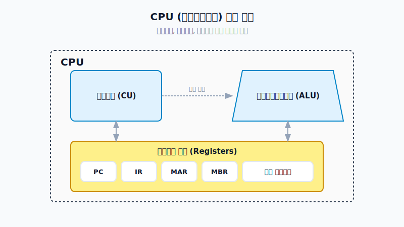

1. **제어 장치 (Control Unit, CU)**: 명령어의 옵코드(Opcode)를 디코딩하여 시스템 전체 부품(ALU, 레지스터, 메모리 제어기)에 적절한 제어 신호(타이밍 펄스)를 발령하는 마이크로 스케줄러입니다.
2. **산술 논리 연산 장치 (ALU)**: 실수/단정밀도/배정밀도 연산 및 시프트(Shift), 비트 마스킹 메커니즘을 책임지는 조합 논리 회로의 집합체입니다.
3. **레지스터 세트 (Registers)**: CPU 다이(Die) 내부에 물리적으로 내장된 플립플롭 집합체로, 문맥 공간 내에서 가장 빠른 임시 캐시 공간입니다.

특히, 시스템 프로그램과 운영체제 루틴이 상호작용하기 위해서는 주요 **레지스터의 용도**를 정확히 파악해야 합니다.

명령어가 존재하는 공간의 위치를 지정하는 **PC(Program Counter)**, 인터럽트와 시스템 권한 모드(Kernel/User)를 관리하는 **PSW(Program Status Word)**는 차후 3강에서 다룰 프로세스 컨텍스트 스위칭의 가장 핵심적인 스냅샷 자원(Context)입니다.

 

## 🛣️ 2. 하드웨어 인터커넥션: 시스템 버스와 I/O 제어

독립된 각 하드웨어 모듈은 마더보드의 구리 배선인 **시스템 버스(System Bus)**를 통해 단일 논리망으로 결합됩니다. 

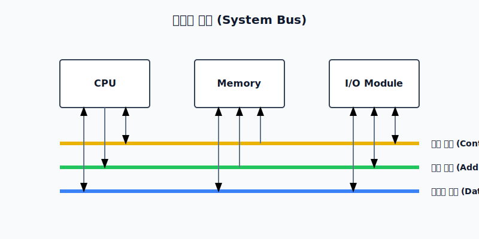

* **데이터 버스(Data Bus)**: 32비트/64비트 워드(Word) 데이터가 전기적 시그널을 타고 양방향 전송되는 물리적 채널입니다.
* **주소 버스(Address Bus)**: CPU가 I/O 포트나 메모리의 물리/가상 주소를 타겟팅하는 단방향 채널입니다.
* **제어 버스(Control Bus)**: IRQ(디바이스의 인터럽트 요청), Memory Read/Write, 버스 승인 등 동기화를 위한 제어 신호가 흐릅니다.

특히 시스템 버스에 물려 있는 저속의 입출력 모듈(I/O)은 고속의 CPU와의 임피던스(속도) 불일치를 해결해야 합니다. 초창기 운영체제 아키텍처는 I/O의 응답 제어 방식 최적화를 위해 발전해 왔습니다.

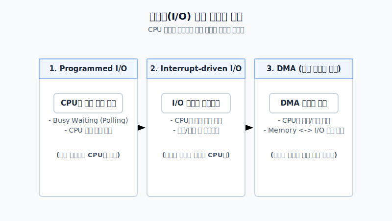

기존 **Programmed I/O**의 치명적 병목 현상(Busy Waiting)을 타파하기 위해, 하드웨어 소자가 주도권을 쥐는 **인터럽트(Interrupt)**가 도입되었고, 메모리와 외부 장치 간 데이터를 다이렉트로 전송하여 CPU의 개입을 시작과 종료 시점 에만 제한하는 **DMA(Direct Memory Access)** 메커니즘은 현대 SSD와 고대역폭 네트워크 인프라의 근간이 되었습니다.

 

## 📊 3. 폰 노이먼 병목과 메모리 계층화 전략

CPU의 클럭 속도는 기하급수적으로 빨라진 반면, DRAM 기술 기반의 메인 메모리 레이턴시는 이를 쫓아가지 못해 발생하는 **폰 노이먼 병목(Von Neumann Bottleneck)**을 해결하기 위해, 현대 아키텍처는 **메모리 계층 구조(Memory Hierarchy)**를 필수적으로 도입했습니다.

고속이지만 비트(Bit)당 단가가 매우 높은 SRAM 컴포넌트는 캐시 메모리에 탑재되고, 상대적으로 느리며 높은 집적도를 가진 DRAM은 메인 메모리 영역에 탑재됩니다. 이 구조의 효율성은 **지역성의 원리(Principle of Locality)**에 의해 극대화됩니다.

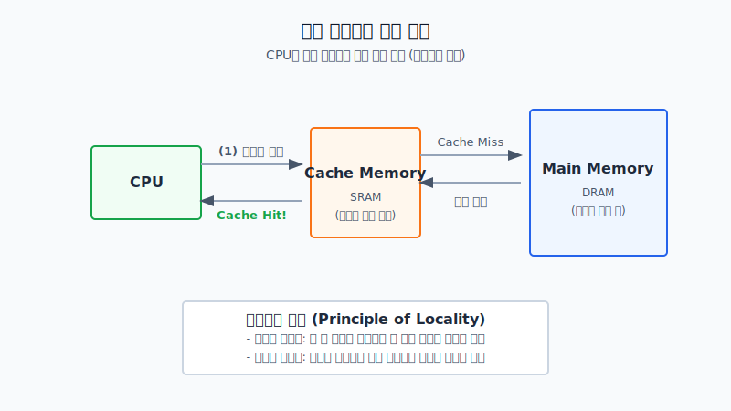

과거 한 번 참조된 데이터가 곧 다시 등장할 확률이 높다는 시간적(Temporal) 지역성과, 참조된 데이터 근처에 위치한 메모리 슬롯이 참조될 확률이 높다는 공간적(Spatial) 지역성은 **캐시 히트율(Cache Hit Rate)**을 90% 이상 유지하게 해주는 통계적 알고리즘의 바탕이 됩니다.

 

## 🚀 4. 명령어 실행 기저 메커니즘과 파이프라이닝

소프트웨어가 동작하기 위한 최소 단위 실행 명령은 코어 트랜지스터가 해독할 수 있는 일정한 바이너리 포맷을 가져야 합니다.

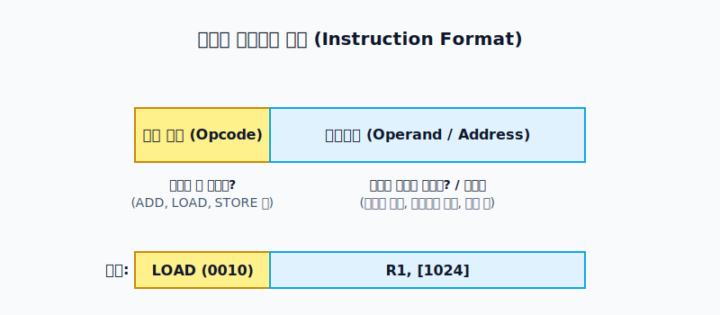

모든 x86이나 ARM 바이너리는 연산 작업(Opcode)과 메모리나 레지스터의 타겟 주소(Operand)가 포장 배열된 형태의 구조체를 따릅니다. 이를 실제 CPU가 작동시키는 매커니즘을 **명령어 사이클(Instruction Cycle)**이라 합니다.

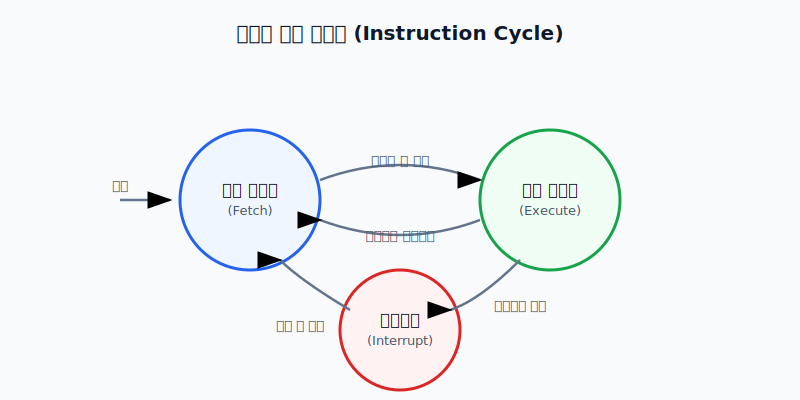

이 사이클 중, 가장 기초가 되는 행위는 메인 메모리 혹은 캐시에서 CPU 내부 공간으로 해당 명령어를 끌고 오는 **인출(Fetch) 사이클**이며, 이는 세 단계의 나노 스케일 **마이크로 연산(Micro-operation)**으로 전개됩니다.

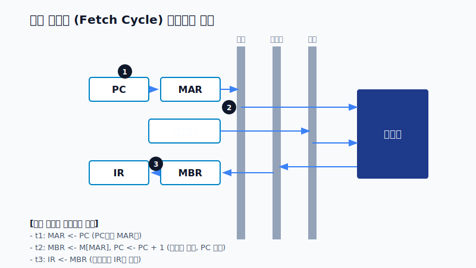

시간 `t1`에서 PC 값을 주소 레지스터(MAR)로 옮기고, `t2`에서 메모리를 읽어 MBR에 실어오며 프로그램 논리를 위로 스텝(PC++)시킵니다. 이후 `t3`에서 연산을 위해 인터널 레지스터인 IR로 최종 이관합니다. 

현대 프로세서(특히 ARM을 필두로 한 스마트 디바이스 아키텍처)의 핵심 코어 설계 사상은 단순하고 직관적인 명령어 집합인 RISC 아키텍처의 파이프라이닝(Pipelining) 성능입니다.

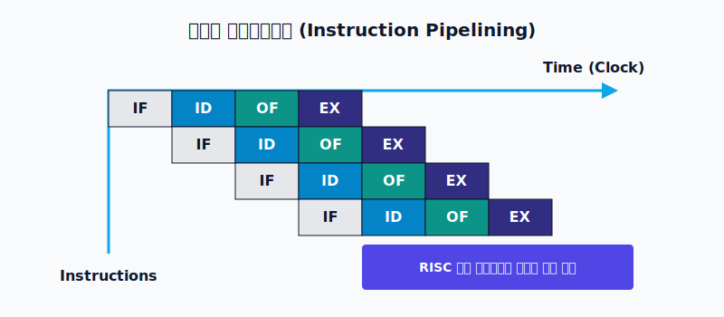

**RISC 명령어의 가장 큰 장점은 다단계 파이프라이닝 최적화입니다.** 인출(IF), 디코드(ID), 실행(EX), 결과 쓰기(WB/OF) 등의 스텝을 시간 축으로 병렬 오버랩 처리함으로써, 1 클럭-사이클 당 1 명령어 처리가 가능한 슈퍼스칼라(Superscalar) 성능을 구현할 수 있습니다.

 

## ⚡ 5. 운영체제 전환의 방아쇠: 인터럽트 제어

소프트웨어 시스템에서 비동기적 이벤트를 가장 효과적으로 제어하는 요소가 바로 인터럽트입니다. 이는 단순한 속도차 극복을 넘어서 프로세스와 운영체제 간의 컨텍스트를 스위칭하는 본질적인 계측 장치입니다.

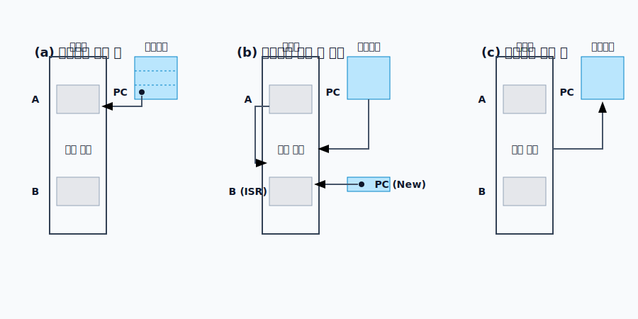

마이크로프로세서는 현재 프로그램 `A`를 동작시키는 도중 인터럽트 시그널 핀(Signal pin)을 탐지하면 즉각적으로 하드웨어 **스택(Stack)** 메모리 공간에 현재의 PC 값과 레지스터 스냅샷을 푸시(Push)합니다. 이후 인터럽트 핸들러 함수(ISR) 주소로 PC를 점프하게 시킨 뒤 해당 루틴이 끝나면 스택에서 주소를 팝(Pop)하여 중단되었던 프로그램 `A`의 정확한 위치로 복귀하게 됩니다.

 

## 🛠️ 6. 시스템 개발 환경 및 C 컴파일링 툴체인 (별첨)

시스템 커널 개발, 드라이버 제작 및 엔지니어링 수준의 프로그래밍을 위해서는 쉘 기반의 스탠다드 환경을 숙달해야 합니다. `vi(VIM)` 에디터는 모드 전환이라는 철학으로 단축키 조합을 통한 개발 생산성 극대화를 추구합니다.

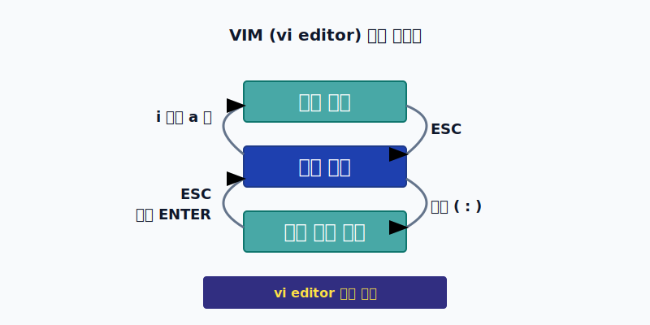

이렇게 작성된 `C/C++` 소스 코드는 우리가 알고리즘 로직을 기재한 것일 뿐, 프로세서가 인식하려면 로우-레벨(Low-level) 기계어 바이너리로 번역되어야 합니다. 리눅스의 표준 컴파일러인 **GCC (GNU Compiler Collection)**는 크게 4개의 고유한 파이프라인 단계로 빌드를 수행합니다.

단순해 보이는 `gcc -o output source.c` 명령의 내부는 다음과 같이 모듈화되어 철저한 분업을 진행합니다.

1. **전처리 단계 (Preprocess)**
   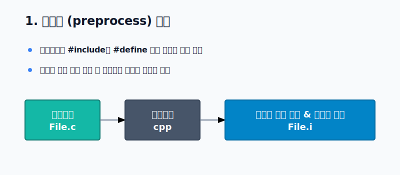
   `cpp` (C Preprocessor)가 동작합니다. 소스코드 내의 모든 `#define` 매크로들을 인라인 치환하고, `#include` 지시어를 추적해 헤더 파일 원문을 모두 복사-붙여넣기 형태로 삽입하여 무거운 `.i` 중간 소스를 생성합니다.

2. **컴파일 단계 (Compile)**
   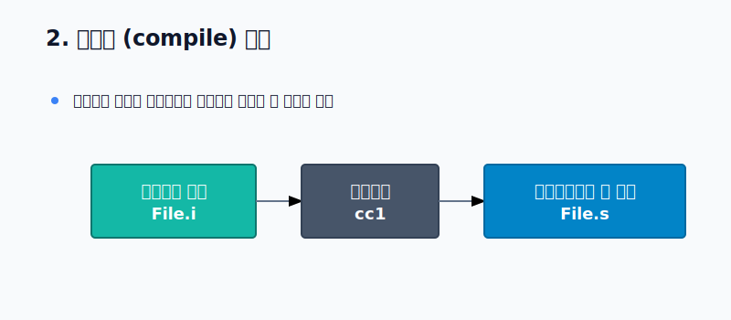
   사실상의 컴파일러 코어인 `cc1`이 동작합니다. 이 C 언어 코드를 파싱하고 최적화하여 저수준의 아키텍처 특화 언어인 **어셈블리어(Assembly)** 형태의 `.s` 텍스트 화일을 뽑아냅니다. 문법적 에러는 오직 이 단계에서 색출됩니다.

3. **어셈블 단계 (Assemble)**
   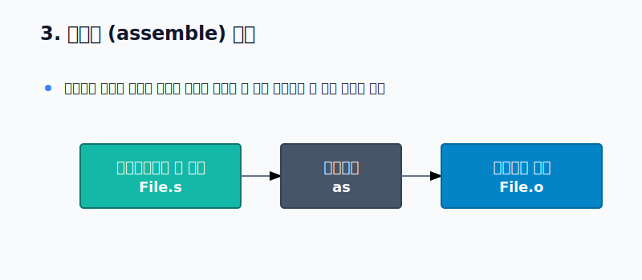
   하드웨어 어셈블러 `as`가 동작합니다. Mnemonic(니모닉) 단위의 어셈블리어 코드를 0과 1로 포맷팅된 실제 이진 기계어(Machine code)로 인코딩하여 **재배치 가능한 오브젝트 화일(Object File, .o)**를 만들어 냅니다.

4. **링크 단계 (Link)**
   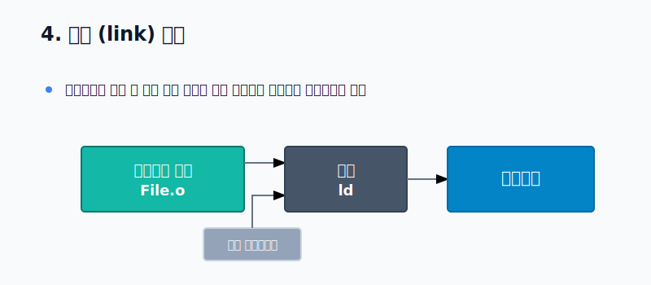
   시스템 링커 `ld`가 동작합니다. 코드에서 호출한 리눅스 표준 커널 C 라이브러리(libc 등)의 오브젝트 코드와 사용자가 만든 여러 `.o` 파일들을 주소 체계에 맞춰 정적으로 연결 및 병합함으로써, 최종적으로 운영체제 안에서 구동되는 **단일 실행 바이너리(Executable)** 포맷(보통 리눅스상 ELF)을 렌더링합니다.

> **📚 참고문헌**
> * David A. Patterson, John L. Hennessy, 『Computer Organization and Design ARM Edition』, Morgan Kaufmann.
> * 구현회, 『운영체제 - 그림으로 배우는 구조와 원리』, 한빛아카데미, 2016.
> * GNU Compiler Collection (GCC) Internals Documentation.
