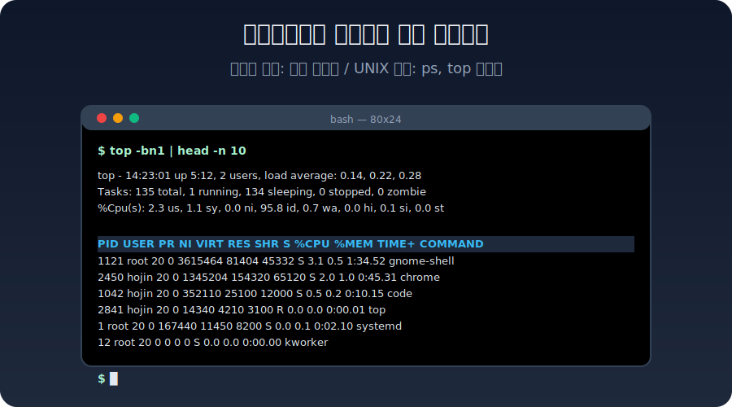
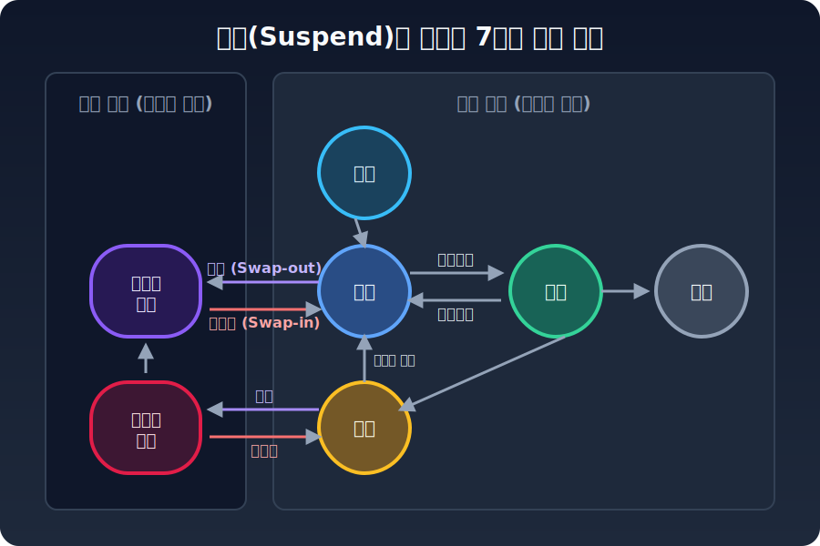
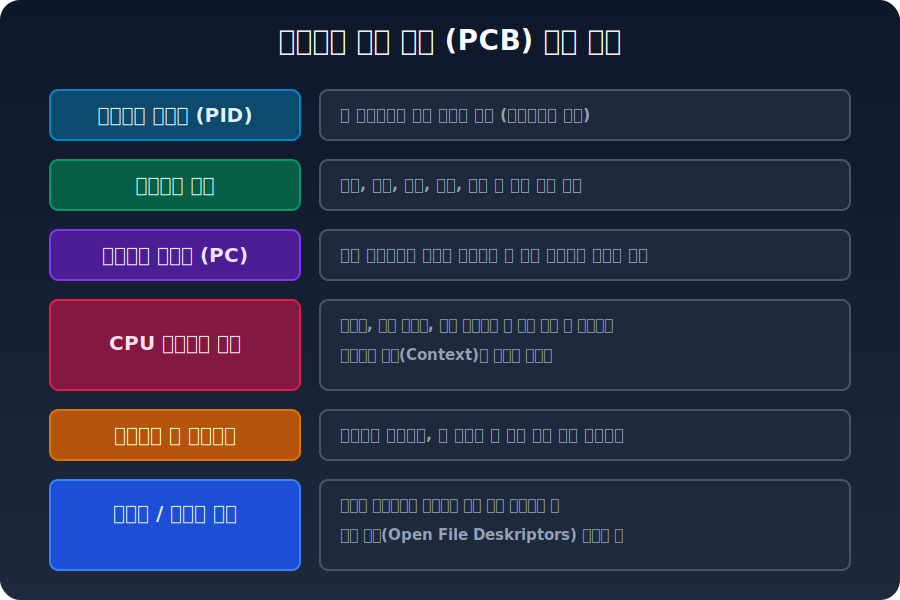
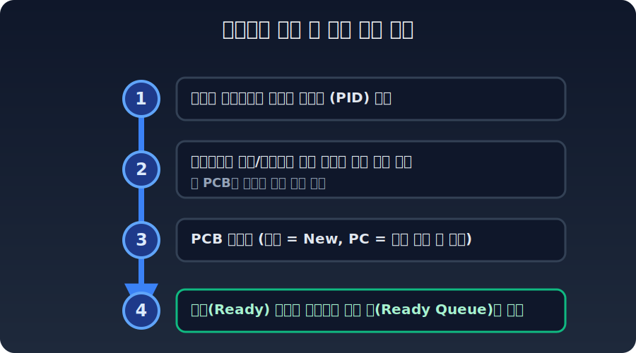
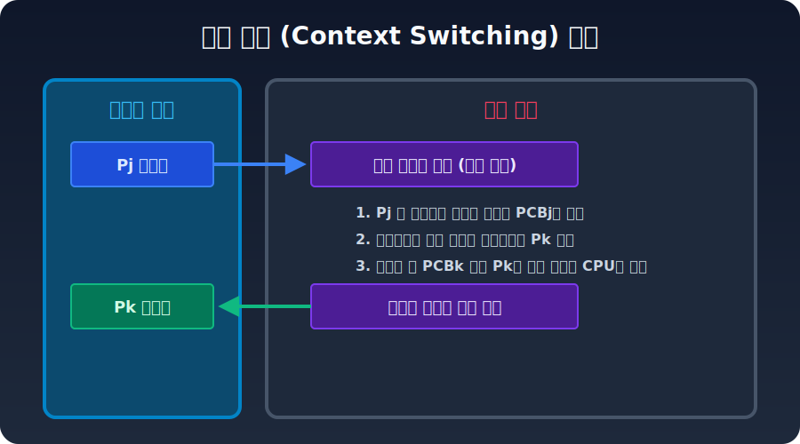
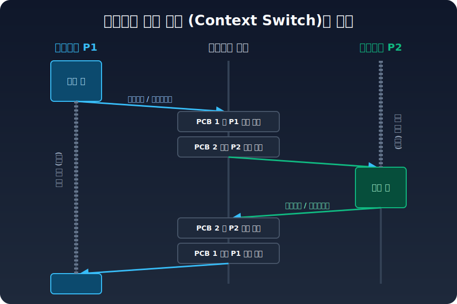
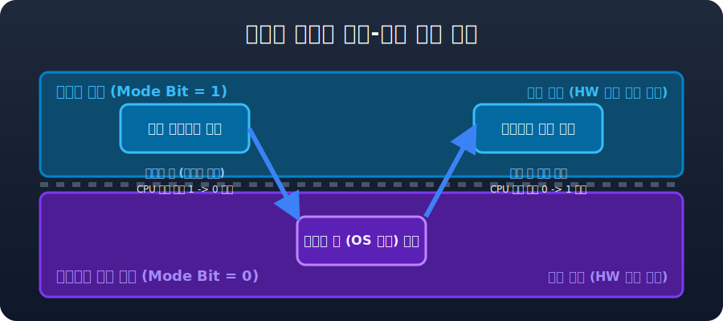
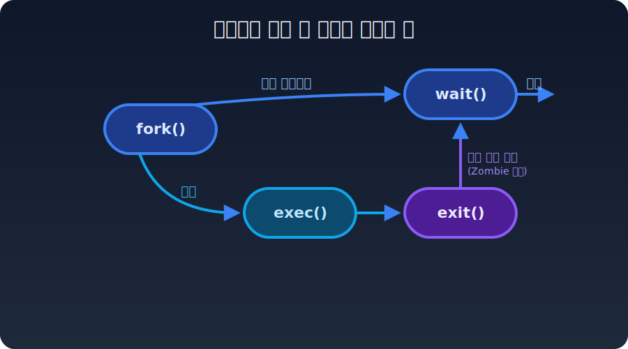

# 3강. 프로세스와 컨텍스트 스위칭

운영체제의 핵심 임무 중 하나는 한정된 CPU 자원을 여러 프로그램이 효율적으로 나누어 쓸 수 있도록 조율하는 것입니다. 본 강의에서는 **‘실행 중인 프로그램’**을 의미하는 **프로세스(Process)**의 탄생과 소멸 과정, 프로세스 메모리 구조, 그리고 프로세스 간에 CPU 제어권이 오고 가는 **문맥 교환(Context Switching)**의 기술적 메커니즘을 학습합니다.

---

## 🎯 학습 목표

* **프로그램(Program)**과 **프로세스(Process)**의 개념적, 물리적 차이를 명확히 구분할 수 있다.
* 프로세스의 일반적인 **메모리 할당 구조(Code, Data, Heap, Stack)**를 파악한다.
* 프로세스의 **5상태 및 7상태(중단 포함) 전이** 과정을 운영체제 스케줄러 관점에서 설명할 수 있다.
* 커널이 프로세스를 관리하기 위해 유지하는 **프로세스 제어 블록(PCB)**의 자료구조와 매핑을 이해한다.
* CPU 시간 분할을 위한 **문맥 교환(Context Switching)**과 **모드 전환(User/Kernel Mode Switch)**의 차이와 원리를 분석한다.
* 시스템 호출인 `fork()`, `exec()`, `wait()`, `exit()`를 통한 프로세스 계층과 수명 주기를 파악한다.

 

## 💻 프로그램 vs 프로세스

디스크에 저장되어 있는 실행 파일 자체는 스스로 아무것도 할 수 없는 정적인 **프로그램(Program)**에 불과합니다. 사용자가 이를 실행하여, 커널(OS)이 디스크 공간에 있던 코드를 메인 메모리(RAM)로 **적재(Load)**한 뒤 CPU 파이프라인의 제약을 받을 수 있는 동적 상태가 되었을 때, 비로소 **프로세스(Process)**라고 부릅니다.

### 프로세스의 일반적인 메모리 구조
각 프로세스는 운영체제로부터 고유한 가상 메모리 공간을 할당받습니다. 이 공간은 일반적으로 아래와 같이 철저히 분리된 구역(Segment)으로 관리됩니다.

* **Code (Text)**: 실행할 기계어 명령어가 불변의 형태(Read-Only)로 저장되는 공간입니다.
* **Data**: 전역 변수나 정적(Static) 변수들이 프로그램 시작과 함께 할당되는 영역입니다.
* **Heap**: 개발자가 `malloc`, `new` 등을 통해 동적으로 할당하고 해제하는 메모리 영역으로, 낮은 주소에서 높은 주소 방향으로 자라납니다.
* **Stack**: 함수 호출에 따른 지역 변수, 매개변수, 반환 주소 등을 임시로 저장하는 후입선출(LIFO) 영역으로, 높은 주소에서 낮은 주소로 자라납니다.

> [!TIP]
> **프로세스 목록을 직접 확인하는 방법**
> Windows에서는 [작업 관리자]를 통해, UNIX/Linux 기반 OS에서는 터미널에 `ps` 나 `top` 명령어를 쳐서 현재 실행 중인 프로세스의 PID, 메모리, CPU 점유율 실시간 모니터링이 가능합니다.
> 

 

## ♻️ 프로세스의 생명 주기 상태 모델

다중 프로그래밍 및 시분할 처리를 위해 프로세스는 고정되어 있지 않고 일생동안 여러 개의 **상태(Condition State)**를 오가게 됩니다. 현대 OS 스크리닝의 근간이 되는 **5-State Model**은 다음과 같습니다.

1. **New (생성)**: 커널 공간에 공간과 PCB가 막 할당된 단계.
2. **Ready (준비)**: CPU를 할당받기 위해 준비 큐(Ready Queue)에서 대기하는 상태. (스케줄러의 타깃)
3. **Running (실행)**: **디스패치(Dispatch)** 과정을 통해 CPU 제어권을 얻어 실제 명령어를 수행 중인 상태.
4. **Blocked / Wait (대기)**: 디스크 리딩이나 네트워크 송수신 등 오랜 시간이 걸리는 I/O 인터럽트가 필요하여 **스스로 CPU를 반납**하고 대기 큐로 들어간 상태. 이벤트가 처리되면 다시 Ready로 전환.
5. **Terminated (종료)**: 작업을 모두 마치고 자원을 반환한 단계.

### 한정된 메모리 최적화: 7상태 모델 (Suspend)
물리적인 메모리가 가득 차면, 운영체제는 덜 중요한 프로세스의 메모리 전체를 하드 디스크의 특정 공간(Swap Area)으로 임시로 쫓아냅니다(`Swap-out`). 이 과정을 반영하여 기존 모델에 **중단(Suspend)** 상태가 추가되어 7상태 모델로 확장됩니다.

* **Suspend Ready (중단된 준비)**: 우선순위가 높은 작업에 의해 밀려, 준비 상태임에도 디스크로 스왑-아웃당한 상태.
* **Suspend Wait (중단된 대기)**: 입출력 대기 상태이다가 메모리 공간 확보를 위해 디스크로 쫓겨난 상태.

 

## 🗃️ 운영체제 커널의 심장: PCB (프로세스 제어 블록)

수많은 프로세스가 수 밀리초 단위로 CPU를 번갈아서 사용하는 환경에서, 어느 주소까지 코드를 실행했는지(Program Counter), 당시 레지스터에는 어떤 값이 남았는지를 반드시 저장해야 합니다. 이를 위해 운영체제 커널 구역에는 **PCB (Process Control Block)**라는 매우 촘촘한 구조체가 개별 프로세스마다 관리됩니다.

**물리적 맵핑** 관점에서 보면, 유저 영역의 메모리 최상단에 실제 프로세스의 Data/Code/Stack이 위치하고 커널 메모리 내부는 그 프로세스를 1:1로 가리키는 PCB 배열들이 존재합니다.

이런 정밀한 데이터 구조를 토대로, 프로세스가 커널에 의해 새롭게 **생성되는 과정 4단계**는 다음과 같이 이루어집니다.

 

## ⏳ 문맥 교환 (Context Switching) 과 모드 전환 타임라인

A(P1) 프로세스가 실행되다가, 스케줄링 인터럽트(타이머)나 시스템 콜 등에 의해 B(P2) 프로세스로 CPU 제어권이 넘어가는 과정을 **문맥 교환(Context Switching)**이라고 정의합니다. 이 때는 반드시 커널이 개입합니다.

이 과정 중 커널 코드가 레지스터들을 싹 지우고 복사해 넣는 시간 동안에는 CPU가 다른 유용한 유저의 연산을 일절 수행하지 못합니다. 때문에 이것은 회피할 수 없는 **오버헤드(Overhead)**이며, OS를 설계할 때 이 문맥 교환의 빈도와 속도를 튜닝하는 것이 가장 큰 엔지니어링 미션 중 하나입니다.

### 하드웨어 보안 장치 : 유저 모드와 커널 모드
유저 앱들이 악의적으로 메모리를 망치거나 잘못된 메모리 주소를 참조하지 못하게, CPU는 명령어 실행 권한을 **유저 모드(Mode Bit 1)**와 **커널 모드(Mode Bit 0)**로 엄격히 나눕니다.

일반 소프트웨어 구동 시 이 유저 모드에 있으며, 디스크 접근, 파일 생성, 문맥교환 같은 시스템 동작이 필요할 때 시스템 콜(Software Interrupt/Trap)을 통해 안전하게 진입 장벽을 통과하여 Mode bit을 0으로 떨군 후 커널 스페이스에서 일을 처리하고 다시 모드 비트를 복원합니다.

 

## 🧬 계층적 생명주기: fork() 와 exit() 철학

고전 시스템의 철학에 따라, 모든 프로세스는 하늘에서 뚝 떨어지지 않고 반드시 어떤 부모 프로세스가 복제 명을 함으로써 생성됩니다. 트리 계층을 형성하는 핵심 시스템 콜은 4가지가 있습니다. 

1. **`fork()`**: 부모 프로세스는 자신과 구성이 100% 동일한 **쌍둥이 자식 프로세스를 복제**합니다 (PID 고유 발급).
2. **`exec()`**: 태어난 자식 프로세스는 자신의 주소 공간 내부 코드를 완전히 날려버리고 디스크에서 **전혀 새로운 프로그램의 바이너리를 덮어씌워 실행**합니다. 
3. **`exit()`**: 자식의 사용이 끝나면 종말을 고합니다. 그러나 PCB는 운영체제에 남아 종료 결과 코드를 부모에게 줄 준비를 하며 대기합니다 (`좀비 좀비 상태`).
4. **`wait()`**: 부모 프로세스가 자식의 처리를 기다렸다가, 코드를 넘겨받고 무사히 PCB를 운영체제에서 말살(`Reap`) 시킵니다.

엔지니어는 이 부모/자식 간 `wait-exit`의 동기화 구조를 망가뜨리지 않도록 철저히 주의를 기울여, 시스템의 메모리와 PID가 말라버리지 않게 코딩해야 합니다.

> **📚 참고문헌**
> * Abraham Silberschatz, 『Operating System Concepts (10th ed)』
> * 구현회, 『운영체제 - 그림으로 배우는 구조와 원리』, 한빛아카데미, 2016.
