# 4강. 스레드(Thread)와 프로세스 제어 (Process Control)

이번 강좌에서는 단일 프로세스 내에서 다수의 실행 흐름을 생성하여 동시성(Concurrency)을 극대화하는 **스레드(Thread)**의 구조와 매핑 모델을 심도 있게 분석합니다. 또한 `fork()`와 `exec()` 시스템 호출을 통한 **프로세스 생명주기 제어 및 메모리/PC(Program Counter)의 변화**를 공학적 관점에서 다룹니다.

> [!NOTE] 
> 현대 운영체제에서 다형성(Polymorphism)을 가진 워크로드를 처리하기 위해서는 단일 프로세스를 넘어, 고성능 멀티스레드 아키텍처와 프로세스 생성 패턴을 정확히 이해하는 것이 필수적입니다.

---

## 🎯 학습 목표

1. **스레드 아키텍처 이해**: 프로세스와 스레드의 구조적 차이를 메모리 컨텍스트 기반으로 설명할 수 있다.
2. **다중 스레드 장/단점 분석**: 멀티스레딩 모델의 장점과 자원 공유로 인한 동기화 설계 이유를 파악할 수 있다.
3. **스레드 공간 제어 (Mapping Models)**: 사용자 수준 스레드(N:1)와 커널 수준 스레드(1:1)의 차이점 및 스케줄링 비용을 설명할 수 있다.
4. **프로세스 제어 심화**: `fork()`와 `exec()` 결합 패턴에서 발생하는 메모리 분기 및 PC 이동 메커니즘을 추적할 수 있다.

  

## 1. 다중 스레드의 메모리 레이아웃 및 아키텍처

하나의 프로세스는 기본적으로 하나의 스레드(실행 흐름)를 갖지만, 다수의 작업을 비동기적으로 수행하기 위해 내부에 여러 스레드를 생성할 수 있습니다. 운영체제는 이때 자원의 효율성을 높이기 위해 스레드마다 별도의 **Thread Control Block(TCB)**를 할당하지만, Code/Data 영역은 프로레스 레벨에서 단 하나만 유지합니다.

### (1) 프로세스 단위의 공유 자원
멀티스레드 환경에서 모든 스레드는 자신이 속한 **프로세스의 전역 자원을 공유**합니다.
* **코드 (Code) 및 데이터 (Data) 블록**: 스레드는 프로세스에 로드된 모든 함수와 전역 변수 공간에 접근할 수 있습니다. 
* **힙 (Heap) 영역**: 동적 할당된 메모리를 공유합니다. 이로 인해 스레드간 매우 빠른 통신(포인터 전달만으로 데이터 전송)이 가능하지만 동시 접근을 방지하기 위한 **동기화(Synchronization) 메커니즘 (예: Mutex, Semaphore)**이 필수적으로 동반됩니다.

### (2) 스레드 단위의 격리 자원 (TCB & Stack)
각 스레드가 독립적인 실행 순서를 보장받기 위해서는, 컨텍스트 스위칭의 최소 단위인 **레지스터 집합**과 함수 호출 내역이 담긴 **스택(Stack) 영역**을 별도로 관리해야 합니다.

* **프로그램 카운터 (Program Counter, PC)**: 스레드가 코드 영역 내의 어느 위치를 실행하고 있는지 추적합니다.
* **스택 포인터 (SP) & TCB**: 각 스레드의 함수 호출(Call), 전달 인자, 지역 변수를 저장하는 고유 영역을 갖춥니다.

 

> [!IMPORTANT] 활용 사례 (Use Cases) : 프로세스 내 비동기 처리
> 여러 개의 탭이나 리소스가 동시에 작동하는 애플리케이션은 스레드 아키텍처를 적극 사용합니다.
>
> **사례 1: 워드 프로세서 (Word Processor)**
> 
> 사용자 입력, 화면 렌더링, 주기적 디스크 백업을 가벼운 스레드로 분리하여 시스템 응답성을 유지합니다.
> 
> **사례 2: 웹 브라우저 (Web Browser)**
> 
> 웹 브라우저가 화면을 렌더링할 때 "네트워크 소켓에서 이미지를 다운로드"하는 작업과, "이미 다운로드 된 DOM 엘리먼트를 화면에 배치"하는 작업을 별도의 스레드가 전담합니다. 이를 통해 네트워크 병목이 UI 멈춤으로 이어지지 않고 **비동기 렌더링(Asynchronous Rendering)**을 통해 반응성(Responsiveness)을 극대화합니다.

  

## 2. 사용자 수준 스레드 vs 커널 수준 스레드 매핑 모델

스레드를 생성하고 관리하는 주체(개발자의 라이브러리 vs 운영체제 커널)에 따라 스레드의 특성이 달라집니다. 논리적인 스레드 모델은 커널 레벨 스레드와의 매핑 비율에 의해 성능과 확장성이 결정됩니다.

### A. 사용자 수준 스레드 (다대일, N:1 매핑)
초기 스레드 개념은 **응용 프로그램 레벨의 스레드 라이브러리 (User-Level Thread Library, 예: 초기 POSIX Pthreads)**를 기반으로 관리되었습니다.

* **원리**: OS 커널은 커널 스레드 1개(또는 프로세스 전체)만 인식합니다. 그 위에서 구동되는 수많은 애플리케이션 스레드들은 **프로세스 내 공간의 TCB를 통해 라이브러리가 직접 문맥 교환**을 수행합니다.
* **장점 (Fast Switch)**: 커널 모드 진입이 필요 없으므로 함수 호출 수준으로 문맥 교환이 매우 빠르며 메모리 소비가 적습니다.
* **단점 (Blocking Issue)**: 하나의 사용자 스레드가 System Call (예: File I/O)을 발생시켜 커널 스레드가 대기(Block) 상태가 되면, 해당 프로세스에 속한 다른 모든 사용자 수준 스레드마저 연쇄적으로 멈추는 **블로킹(Blocking) 문제**가 발생합니다. (또한, Multi-Core CPU의 병렬 처리를 온전히 활용할 수 없습니다.)

### B. 커널 수준 스레드 (일대일, 1:1 매핑)
현대의 주류 OS(Windows, Linux O(1) Scheduler 이후 Pthreads 등)는 커널을 통한 일대일(1:1) 매핑 모델을 적극 채택합니다.

* **원리**: 사용자가 스레드 생성을 요청하면, 커널이 이에 상응하는 고유의 커널 스레드를 직접 생성합니다. OS는 응용 프로그램의 TCB를 직접 관리합니다.
* **병렬성(Concurrency & Parallelism)**: Multi-Core 구조에서 다수의 CPU Core에 1:1로 매핑된 프로세스를 직접 분산 할당할 수 있습니다. 한 스레드가 Block 되더라도 다른 스레드는 여전히 다른 코어에서 실행이 보장됩니다.
* **비용 측면**: 스레드 생성이나 전환 시 시스템 콜(Mode Switch, User <-> Kernel)이 발생하므로 오버헤드는 사용자 수준 스레드 방식보다 다소 높습니다.

  

## 3. 심화 기술: 프로세스 제어 및 시스템 호출 (fork / exec)

스레드가 프로세스 내의 "가벼운 실행 흐름"이라면, 프로세스 자체를 생성하고 소멸하는 과정은 OS 입장에서 훨씬 극적인 메모리 변경이 유발됩니다. 유닉스(Unix)/리눅스(Linux) 환경에서 프로세스는 `fork()`로 복제되고, `exec()`로 치환되며 제어됩니다.

### 프로세스 생명주기 제어 호출 규약

1. **`fork()`**: 자신과 동일한 메모리 레이아웃(Code, Data, Heap, Stack)을 가진 자식 프로세스를 분기(Branch)합니다. (최근 OS는 최적화를 위해 Copy-on-Write 방식 적용)
2. **`exec()` 계열 시스템 호출**: 자신의 메모리 주소 공간 (텍스트, 데이터 힙/스택 등)을 완전히 새로운 실행 파일 데이터로 **덮어쓰기(Overwrite)**합니다.
3. **`wait()`**: 좀비 프로세스 방지를 위해, 부모는 자식의 종료(exit) 명령 회수를 기다리기 위해 Blocked 상태에 진입합니다.

### 아키텍처 관점 : fork + exec 수행 시 메모리와 Program Counter 이동 추적
시스템 프로그래밍 시, PC (Program Counter)가 어떻게 이동하는지를 이해하는 것이 동시성 제어의 핵심입니다.

* **After fork**: `fork()` 명령어가 반환되는 시점에 1개의 프로그램이 2개(부모/자식)로 증식합니다. 이 분기점에서 **부모와 자식은 동일한 지점(PC)에서 재개**되나 `pid` 리턴 값(부모: 자식PID, 자식: 0)만 다릅니다. 이 리턴값을 기준으로 분기처리(if~else)를 구현하여, 자식 객체 쪽에서만 `exec()`를 수행하도록 유도합니다.
* **After exec**: 자식 영역에서 `execl()`이 호출되는 순간, **기존 프로세스 메모리의 내용물(Code)이 파괴(Destroyed)**되고 새로운 Binary Executable (예: `/bin/ls`)가 그 자리를 차지합니다. 따라서 `exec()` 호출이 성공하는 한 그 바로 아랫줄에 기재된 `printf("hello")` 같은 코드는 영원히 실행되지 않습니다(PC 포인트 소멸).

 

> [!TIP] exec 계열 함수 규약 요약
> C/C++ 표준에 정의된 exec 계열 함수들은 인자 지정 방식(vector 배열 vs list 표기)과 경로 지정 방식에 따라 구분됩니다.
> * `l` : list (인자들을 나열하여 전달) `execl`, `execlp`, `execle`
> * `v` : vector (인자들을 포인터 배열로 전달) `execv`, `execvp`, `execve`
> * `p` : path (환경 변수 PATH에 지정된 경로 탐색) `execlp`, `execvp`
> * `e` : env (사용자 정의 환경변수 명시적 할당) `execle`, `execve`

  

## 4. 핵심 요약

* 본질적으로 **프로세스는 무거운 "자원 할당 컨테이너 및 소유권자"**이며, **스레드는 가벼운 "CPU 실행 스케줄 단위"**입니다.
* 멀티스레드는 메모리(글로벌 변수 및 힙) 공유를 통해 매우 경제적이고 반응성 높은 퍼포먼스를 보장하지만, **병행성 오류(Concurrency Bug) 및 동기화 설계**가 동반되어야 안전합니다.
* **사용자 수준 스레드(N:1)**는 라이브러리 레벨의 문맥 교환으로 빠르나 커널 통제를 벗어나 블로킹 이슈가 존재하고, **커널 수준 스레드(1:1)**는 각 논리 스레드마다 실제 OS 스레드가 배치되어 우수한 병렬성(Parallelism)과 안정성을 획득합니다.
* `fork()`와 `exec()` 연결 패턴은 프로세스의 복제 후 완전히 새로운 애플리케이션으로 탈바꿈하는 전통적이면서도 가장 강력한 시스템 제어 조합입니다.
