# 5강. 프로세스 동기화 (Process Synchronization)와 상호배제 (Mutual Exclusion)

이번 강좌에서는 다중 프로세스(스레드) 환경에서 발생하는 **동시성 문제(Concurrency Issue)**와 이를 해결하기 위한 **상호배제(Mutual Exclusion)** 메커니즘을 심도 있게 다룹니다. 임계 영역(Critical Section)의 개념부터, 하드웨어 수준의 원자적(Atomic) 명령어, 그리고 OS 레벨의 동기화 객체인 세마포어(Semaphore)와 모니터(Monitor)의 아키텍처를 분석합니다.

> [!NOTE] 
> 동기화(Synchronization)는 현대 운영체제와 멀티스레드 프로그래밍에서 데이터 무결성을 보장하기 위한 가장 핵심적인 기술입니다. 단순히 락(Lock)을 거는 행위를 넘어, 데드락(Deadlock)을 방지하고 병렬 처리 능력을 극대화하는 설계가 요구됩니다.

---

## 🎯 학습 목표

1. **병행성 오류의 원인 규명**: 경쟁 상태(Race Condition)와 데이터 불일치의 메커니즘을 설명할 수 있다.
2. **임계 영역(Critical Section) 구조화**: 안전한 동기화를 위한 4가지 코드 영역(진입, 임계, 퇴출, 나머지)을 설계할 수 있다.
3. **하드웨어 기반 상호배제**: `TestAndSet` 및 `CompareAndSwap`(CAS) 연산의 원자성(Atomicity)을 이해한다.
4. **고급 동기화 객체 활용**: 세마포어와 모니터의 차이점을 파악하고 적재적소에 적용할 수 있다.

  

## 1. 병행 프로세스의 동시성 문제 (Concurrency Issue)

다중 프로그래밍 환경에서 여러 프로세스가 공유 자원(메모리, 데이터베이스, 파일 등)에 동시에 접근할 때, 타이밍이나 스케줄링 순서에 따라 결과가 달라지는 **경쟁 상태(Race Condition)**가 발생할 수 있습니다.

* **손실된 업데이트 (Lost Update) 문제**: 두 개 이상의 프로세스가 동시에 변수값을 읽고 수정할 때, 컨텍스트 스위칭이 명령어(Instruction) 단위 사이에서 발생하면 한 프로세스의 변경 사항이 덮어씌워져 유실됩니다.

* **비일관성 (Inconsistency)**: 이로 인해 프로세스의 실행 속도와 관계없이 일관된 결과가 나와야 한다는 원칙이 깨집니다.

이를 해결하기 위해서는 공유 자원에 대한 **상호 배타적(Mutually Exclusive)** 접근을 보장해야 합니다.

### 생산자-소비자 문제 (Producer-Consumer Problem)
동시성 문제가 가장 흔하게 발생하는 대표적인 아키텍처 스트림 패턴입니다. 정보가 비동기적으로 생산 및 소비되는 과정에서 한정된 버퍼(Shared Memory)를 관리해야 합니다.

  

## 2. 임계 영역 (Critical Section) 아키텍처

경쟁 상태를 방지하기 위해 공유 자원에 접근하는 코드 조각을 **임계 영역(Critical Section)**으로 정의합니다. 한 프로세스가 임계 영역에서 코드를 실행 중일 때는, 다른 어떤 프로세스도 해당 임계 영역에 진입할 수 없어야 합니다.

임계 영역을 바탕으로 상호배제가 이루어지는 개념적, 시간적 관계는 다음과 같습니다.

완벽한 임계 영역 규약(Protocol)을 구현하기 위해서는 다음 3가지 요구조건을 모두 충족해야 합니다.
1. **상호배제 (Mutual Exclusion)**: 이미 임계 영역에서 실행 중인 프로세스가 있다면, 다른 프로세스는 진입할 수 없다.
2. **진행 (Progress)**: 임계 영역에 있는 프로세스가 없고 진입하려는 프로세스들이 있다면, 이들의 진입 순서 결정은 유한한 시간 내에 이루어져야 한다 (교착 상태 방지).
3. **한정 대기 (Bounded Waiting)**: 프로세스가 진입을 요청한 후부터 허용될 때까지 대기하는 시간에 제한이 있어야 한다 (기아 상태 방지).

  

## 3. 하드웨어 기반 상호배제 지원 (TestAndSet)

소프트웨어적인 알고리즘(Dekker, Peterson)만으로는 복잡도와 오버헤드가 크기 때문에, 현대 시스템은 하드웨어 차원에서 메모리에 대한 **원자적(Atomic) 연산**을 제공합니다. 대표적인 것이 `TestAndSet` (TSL) 명령어입니다.

* **원자성(Atomicity) 보장**: 메모리의 기존 값을 읽고, 새로운 값으로 세팅하는 두 가지 동작이 **하나의 불가분한 CPU 명령어** 단위로 처리됩니다. 프로세서가 이 명령을 수행하는 도중에는 어떠한 하드웨어 인터럽트도 문맥을 전환시킬 수 없습니다.
* **한계 (바쁜 대기, Busy Waiting)**: 락을 획득하지 못한 프로세스가 `while(TestAndSet(&lock))` 루프를 돌며 무한정 CPU 사이클을 낭비하는 스핀락(Spinlock) 현상이 발생합니다. 이는 Multi-Core 환경의 짧은 대기에는 적합할 수 있지만, 단일 코어나 긴 작업 대기에는 시스템 성능 저하를 유발합니다.

  

## 4. 운영체제 레벨의 동기화 메커니즘 (Semaphore & Monitor)

바쁜 대기(Busy Waiting)로 인한 CPU 자원 낭비를 막기 위해, 큐(Queue)를 활용하여 프로세스를 대기(Block) 상태로 전환하는 고급 추상화 객체들이 도입되었습니다.

### A. 세마포어 (Semaphore)
에츠허르 다익스트라(Dijkstra)가 고안한 도구로, 정수형 변수와 이 변수에 접근하는 두 가지 원자적 연산 `wait()` (P 연산)와 `signal()` (V 연산)로 구성됩니다.

* **동작 원리**: 
  * `wait()`: 가능한 자원의 수(정수값)를 감소시킵니다. 값이 음수가 되면 해당 프로세스는 대기 큐(Wait Queue)로 이동하여 블록(Block)됩니다.
  * `signal()`: 자원을 반납하고 카운트를 증가시킵니다. 대기 큐에 프로세스가 있다면 하나를 깨워(Wakeup) 준비 큐로 보냅니다.
* **이진 세마포어 (Mutex)**: 값을 0과 1만 가지도록 제한하여 단일 상호배제(Mutual Exclusion) 락으로 사용하는 특수한 형태입니다.
 

* **계수 세마포어 (Counting Semaphore)**: 여러 개의 가용한 자원 인스턴스를 관리할 수 있도록 초기값을 N으로 설정합니다. 자원 한도에 도달하면 이후 요청을 한 타 프로세스들은 차단(Block)되어 대기 상태로 전환됩니다.

### B. 모니터 (Monitor)
세마포어의 제어 오류(예: wait/signal 누락이나 순서 오류, 데드락)를 방지하기 위해, 프로그래밍 언어 자체가 제공하는 **고급 동기화 추상화 구조**입니다. (예: Java의 `synchronized` 키워드)

* **구조**: 모니터 객체 내부의 공유 데이터는 오직 모니터 내부에 정의된 프로시저(메서드)를 통해서만 접근 가능합니다.
* **강제된 상호배제**: 한순간에 오직 1개의 프로세스/스레드만 모니터 내부에 진입하여 코드를 실행할 수 있도록 제어 시스템이 강제로 락 프로토콜을 삽입합니다. 개발자는 명시적 락 관리에 신경 쓸 필요 없이 비즈니스 로직에 중심을 둘 수 있습니다.

  

## 5. 핵심 요약

* **경쟁 상태(Race Condition)**: 병행 프로세스가 공유 자원에 임의의 순서로 접근하여 데이터 불일치가 발생하는 현상입니다.
* **임계 영역(Critical Section)**: 동시 접근을 제한해야 하는 타겟 코드 블록이며 상호배제, 진행, 한정 대기의 3조건을 만족해야 합니다.
* **하드웨어 제어**: `TestAndSet`과 같은 하드웨어 명령어를 이용해 원자적 조작을 지원하지만, 바쁜 대기(Busy Waiting / Spinlock) 구조의 태생적 단점이 존재합니다.
* **소프트웨어 및 OS 제어**: **세마포어(Semaphore)**는 Block & Wakeup 방식을 통해 바쁜 대기 문제를 해결한 척도 도구이며, **모니터(Monitor)**는 개발자의 실수를 원천 방지하기 위해 프로그래밍 언어 계층에서 기본적으로 상호배제를 강제하는 고도화된 객체지향 구조입니다.
