# 7강. CPU 스케줄링 (CPU Scheduling)과 다중 프로그래밍

## 🎯 학습 목표

1. **스케줄링 계층 메커니즘**: 장기, 중기, 단기 스케줄러의 아키텍처 상 역할을 구분하고 디스크와 메모리(Ready Queue), 프로세서(CPU) 간의 컨텍스트 스위칭 파이프라인을 시각화할 수 있다.
2. **트레이드오프 분석 (선점 vs 비선점)**: 인터럽트에 의한 강제 할당(Preemptive)과 프로세스의 자발적 반환(Non-preemptive)의 차이를 성능 지표 관점에서 분석할 수 있다.
3. **성능 평가 지표 (Metrics)**: Turn-around Time, Waiting Time, Response Time 등 스케줄링 알고리즘의 우위를 평가하는 정량분석 기준을 숙지한다.
4. **기업형 커널 스케줄러 구조**: 현대 운영체제의 핵심이자 유닉스/리눅스 스케줄러의 근간인 다단계 피드백 큐(MLFQ) 알고리즘과 에이징(Aging) 기법의 필요성을 논리적으로 전개할 수 있다.

> [!WARNING] 
> 현대의 다중 프로그래밍(Multi-programming) 체제에서 CPU는 단 1ms라도 쉬어선 안 됩니다. 대기 큐(Wait Queue)에 쌓인 수백, 수천 개의 프로세스 중 **다음 틱(Tick)에 CPU를 누구에게 줄 것인지** 결정하는 스케줄링의 효율성이 곧 운영체제의 전체 퍼포먼스를 좌우합니다.

  

## 1. 프로세스 상태와 CPU 버스트

프로세스의 스케줄링을 이해하기 위해서는 프로세스가 겪는 상태 변화와 CPU 활용 패턴을 알아야 합니다.

### 1-1. 프로세스의 기본 상태 변화

프로세스는 생성되어 준비 구역을 거쳐 CPU를 할당받아 실행되며, 입출력(I/O)이 필요할 경우 대기(보류) 상태로 이동하는 순환 구조를 가집니다.

### 1-2. CPU 버스트와 I/O 버스트

프로세스의 인생은 결국 **CPU 버스트(계산 로직)**와 **입출력 버스트(디스크/네트워크 대기)**의 끝없는 반복입니다.

실제 통계를 내어보면 대부분의 프로세스는 극도로 짧은 CPU 버스트를 가지며 잦은 입출력을 발생시킵니다 (I/O Bound). 이 때문에 CPU를 쉴 새 없이 돌리기 위해 세밀한 스케줄링이 필수불가결합니다.

  

## 2. 큐잉(Queueing) 아키텍처와 스케줄러 계층

CPU와 입출력 장치는 하나지만 프로세스는 수천 개이므로, 운영체제는 다양한 **큐(Queue)**를 사용해 이들을 관리합니다.

### 2-1. 스케줄링 큐의 구조

준비 큐(Ready Queue)와 다양한 장치 큐들은 내부적으로 큐 헤더를 두고 프로세스의 PCB를 연결형태(Linked List)로 매달아 순차적으로 처리합니다.

### 2-2. 다각적 큐잉 파이프라인

프로세스가 CPU를 거쳐 인터럽트나 입출력 요청으로 인해 다시 큐로 돌아오는 전체적인 시스템 큐잉 파이프라인입니다. 이 도표를 제어하는 것이 바로 '스케줄러'입니다.

### 2-3. 스케줄러의 3단계 계층 구조
디스크에서 프로세서를 향해 나아가는 과정에 따라 3개의 스케줄러로 나뉩니다.

* **장기 스케줄러 (Long-term Scheduler)**: 디스크 -> 메모리 (1단계)
* **중기 스케줄러 (Medium-term Scheduler)**: 메모리 부족 시 메모리 <-> 디스크 강제 스왑 (2단계)
* **단기 스케줄러 (Short-term Scheduler/Dispatcher)**: 준비 큐 -> CPU 실제 할당 (3단계)

  

## 3. 선점형 vs 비선점형과 성능 평가 지표

### 3-1. 정책 분류 (Preemptive vs Non)
* **비선점형**: 한 놈이 끝날 때까지 CPU를 절대 방탈당하지 않음. Context Switch 오버헤드는 적지만 뒤에 줄 선 작업들이 무기한 지연되는 호위 효과 발생.
* **선점형**: 운영체제가 타이머 틱(Tick)을 재면서 강제로 CPU를 뺏어옴. 높은 응답성이 생명인 현대 데스크탑/모바일 기기의 필수 조건.

### 3-2. 스케줄링 알고리즘 성능 지표 (Metrics)
스케줄링 알고리즘이 얼마나 좋은가를 수학적으로 평가하기 위한 기준입니다.

* **대기 시간 (Waiting Time)**: 큐에서 대기한 시간의 총합.
* **응답 시간 (Response Time)**: 도착 후 최초로 화면에 결과가 나오기까지의 시간. 데스크탑 UX에서 가장 중요함.
* **반환 시간 (Turnaround Time)**: 도착 후 완전히 프로세스가 종료될 때까지의 생애 주기.

  

## 4. 고전 알고리즘 분석 (FCFS & SJF)

### 4-1. FCFS (First Come First Served)
무조건 먼저 온 프로세스를 우선 처리하는 가장 기초적인 알고리즘입니다 (비선점).

**예시 1: 긴 프로세스가 먼저 도착한 경우**

가장 긴 P2가 앞에 있기 때문에 P3, P4, P5가 끔찍하게 오래 기다려야 합니다. (평균 대기시간 26.0)

**예시 2: 짧은 프로세스가 먼저 도착하도록 정렬된 경우**

단순히 짧은 순서대로 도착했을 뿐인데 평균 대기시간이 무려 **13.2**로 절반이나 단축되었습니다. 여기서 착안한 것이 바로 SJF입니다.

### 4-2. SJF (Shortest Job First)
실행 시간이 짤을 것으로 예상되는 놈에게 무조건 우선순위를 주는 알고리즘. 수학적으로 증명된 **가장 완벽하게 대기 시간을 줄이는 방법론**입니다.

**순수 SJF (비선점형)**

실행 중엔 건들지 않지만, 큐에서 대기 중인 녀석들 중에선 가장 짧은 놈을 골라냅니다. (평균 대기 13.6)

**선점형 SJF (SRTF: Shortest Remaining Time First)**

실행 중인 프로세스가 있더라도, 새로 큐에 진입한 프로세스의 잔여 시간이 더 짧으면 가차 없이 현재 실행을 중단하고 선점합니다! (평균 대기 12.6으로 극한의 최적화 달성)

> [!WARNING]
> SJF는 "미래의 프로세스 사용 시간을 OS가 미리 정확히 예측해야 한다"는 치명적인 전제가 필요해 현실적으로 직접 구현이 불가능합니다. 

  

## 5. 실무 알고리즘: 다단계 피드백 큐 (MLFQ) 구조

SJF는 이룰 수 없는 이상향이지만, 현대의 OS는 **동적인 피드백과 우선순위**를 통해 이를 흡사하게 흉내 냅니다.

### 5-1. 우선순위 스케줄링의 문제점: 기아 상태와 Aging

실행 시간이 긴(또는 등급이 낮은) 프로세스는 평생 CPU를 할당받지 못해 굶어 죽는 **기아 상태(Starvation)**에 빠집니다. 이를 막기 위해 OS는 오래 대기한 프로세스의 나이를 먹이듯 우선순위를 올려주는 **에이징(Aging)** 기법을 사용하여 반드시 처리됨을 보장합니다.

### 5-2. 고도화된 스케줄링 규칙 (MLFQ)
현대 시스템(리눅스, 윈도우)은 단순히 원형 큐를 도는 RR(Round-Robin) 방식을 넘어 다단계의 큐 계층을 둡니다.

1. I/O를 자주 발생시키는 대화형(Interactive) 앱은 즉각적인 반응성 확보를 최우선으로 하여 최상위 등급 큐에 배치합니다.
2. 반면 CPU를 오랫동안 100% 잡아먹는 렌더링, 인코딩 프로그램은 Time Quantum을 소진할 때마다 OS가 패널티를 부여해 하위 큐로 계속 강등(Demote)시켜 우선순위를 박탈합니다.
3. 최하위 계층에 떨어진 무거운 앱들도 Aging을 통해 최소한의 생존을 보장받습니다.

결국 **"과거에 CPU를 많이 썼던 놈은 뒤로 미루고, I/O 대기를 한 놈에게 우선권을 준다"**는 경험칙적 발상으로, 예측 불가능한 SJF의 한계를 돌파한 것이 현대 운영체제의 핵심 전략입니다.

  

## 6. 핵심 요약
* **스케줄러의 티어**: `장기`(디스크->메모리), `중기`(메모리<->스왑), `단기`(메모리->CPU).
* **큐잉 아키텍처**: OS는 PCB를 엮은 여러 계층의 Linked-List 큐를 운영.
* **선점성**: 데스크탑은 타이머에 의해 쪼개진 시분할(Time-sharing) 선점형 방식이 필수.
* **성능 지표**: UX의 핵심은 응답시간과 평균 대기시간의 최소화 측정.
* **SJF와 MLFQ**: SJF는 이론적 이상향을 제공하며, MLFQ는 에이징과 피드백 강등 규칙을 활용하여 SJF의 효과를 현실 시스템 단에 완벽하게 시뮬레이션한 아키텍처.
