# 9강. 프로세스 간 통신 (IPC, Inter-Process Communication)

## 🎯 학습 목표

1. **IPC의 필요성과 커널의 역할**: 운영체제의 프로세스 간 메모리 보호 기법을 이해하고, 왜 정보를 주고받기 위해 커널(Kernel)이라는 중재자가 필요한지 설명할 수 있다.
2. **시그널(Signal) 메커니즘**: 소프트웨어 인터럽트로서의 시그널 발생 및 전달 파이프라인을 시각화하고 커널의 역할을 정의한다.
3. **스트림형 통신 (Pipe & FIFO)**: 프로세스 간 바이트 스트림 통신인 익명 파이프(Anonymous Pipe)와 네임드 파이프(FIFO)의 구조적 차이와 부모-자식 간 제약 조건 유무를 비교 분석한다.
4. **메모리 매핑 구조 (Shared Memory)**: 가장 속도가 빠른 IPC인 공유 메모리의 원리(shmget, shmat)를 프로세스의 논리적 주소 공간과 물리적 메모리 관점에서 조망한다.

> [!WARNING]
> 기본적으로 운영체제는 한 프로세스가 다른 프로세스의 메모리를 침범하는 것을 극도로 차단합니다(보호 모드 / Protection). 따라서 프로세스들이 데이터를 교환하려면 항상 **특권 레벨(Kernel Mode)**에 존재하는 기능적 통로인 IPC 장치를 동원해야 합니다. 

  

## 1. 시그널 (Signal) 처리 메커니즘

운영체제에서 프로세스 간 통신의 가장 기초적이고 비동기적인 기법은 **시그널(Signal)**입니다.
어떤 프로세스가 무언가 잘못되었거나(예: 'Segfault'), 인터럽트(예: 사용자 `Ctrl+C` 입력)를 발생시킬 때, 커널은 이 '신호'를 가로채어 목적지 프로세스의 PCB에 기록해둡니다.

1. **발생(Generate)**: Process #2에서 특정 이벤트(Signal-A)가 발생.
2. **커널 개입(Kernel Delivery)**: 커널이 이를 확인한 후, 타깃인 Process #1의 PCB에 '시그널이 도착했음(Pending)'을 플래그로 셋업.
3. **수행(Handling)**: Process #1이 다시 CPU를 할당받기 전, 커널은 Process #1에게 미리 약속된 **별도의 시그널 핸들러(Handler_A)** 코드를 강제로 점프시켜 실행되게 함.

> **특징**: 데이터의 전달보다는 "어떤 이벤트가 일어났다"는 플래그의 교환. 처리기(Handler)를 지정하지 않으면 프로세스 강제 종료(Kill) 등 기본 동작을 수행함.

  

## 2. 스트림 통로 기법: 파이프(Pipe)와 파일 기술자

두 프로세스 사이의 표준 입/출력을 서로 이어버려, 물이 파이프를 타고 흐르듯 데이터를 바이너리 스트림 형태로 전달하는 방식. 터미널 명령어를 다룰 때 매우 자주 사용됩니다.

### 2-1. `pipe()` 시스템 콜 구조
파이프는 단방향(Half-duplex) 통로입니다. `pipe()` 함수를 호출하면, 마치 파일을 열었을 때처럼 2개의 **파일 기술자(File Descriptor)** 배열을 리턴 받습니다. 
* `filedes[0]`: 파이프에서 꺼내 읽는 출구
* `filedes[1]`: 파이프에 데이터를 넣는 입구

### 2-2. 부모-자식 간의 파이프 (Anonymous Pipe)
파이프는 만들어진 프로세스 내부에서만 포트가 뚫려있어 외부 프로세스는 접근할 수 없습니다. 따라서 보통 `fork()`를 통해 자식을 생성하여 **기술자(FD)를 복사**받은 뒤 양쪽을 잇는 형태로 사용됩니다.

통신의 충돌을 막기 위해 부모는 읽는 쪽(0번)을, 자식은 쓰는 쪽(1번)을 닫아 완전한 일방향 흐름을 만들어야 합니다 (물론 그 반대도 가능합니다). 만약 양방향 통신이 필요하다면 아래와 같이 반드시 **파이프 2개**를 교차 설치해야 합니다.

> [!TIP]
> **FIFO (Named Pipe)**: 부모-자식 관계가 없는 완전히 남남인 프로세스끼리 파이프 통신을 하려면 `FIFO`를 생성해야 합니다. 이는 디스크 상에 파일명(Named)을 띈 특수 파일 버퍼를 생성해 양쪽 프로세스가 해당 파일명으로 통신 포트를 개방하는 방식입니다.

  

## 3. 궁극의 포인터 교환: 공유 메모리 (Shared Memory)

파이프와 메시지 등의 IPC 방식은 전송할 데이터를 **송신자 메모리 -> 커널 메모리 -> 수신자 메모리** 순으로 복사해야 하는 병목(Overhead)이 큽니다.
이 오버헤드를 근본적으로 타파한 방식이 바로 **공유 메모리**입니다.

### 3-1. 생성 (shmget)
커널 영역 내 물리 메모리의 일부 뭉텅이를 IPC 전용 "공유 메모리 공간"이라고 선언하고 고유한 키(Key) ID를 가져옵니다.

### 3-2. 주소 매핑 / 부착 (shmat - Attach)
가장 핵심인 부분입니다. 커널 내부의 물리적 메모리 블록을, 프로세스 A와 프로세스 B의 가상 주소 공간(Page Table) 내 **특정 빈 곳에 그대로 매핑(Mapping)** 시켜 줍니다.

### 3-3. 직접 통신 (Data Write/Read)
이제 A와 B는 커널을 거칠 필요가 없습니다. 프로세스 A가 자신의 메모리 주소(예: 배열)에 값을 썼을 뿐인데, 물리적으로 동일한 램을 가리키고 있기 때문에 B 프로세스 쪽 변수에 즉시 값이 튕겨져 나옵니다. 

> [!WARNING]
> **데이터 동기화 부재**  
> 공유 메모리는 속도 측면에서 '제로 카피(Zero-Copy)'의 이점을 지니지만, A가 값을 한창 쓰고 있는데 B가 동시에 읽어가거나 써버리는 **경쟁 상태(Race Condition)**를 막아주지 않습니다. 따라서 이 충돌을 해결하기 위해 반드시 **세마포어(Semaphore)** 같은 별도의 잠금 매커니즘을 동반해야 실무에서 사용할 수 있습니다.

  

## 4. 핵심 요약

| 분류 | 특징 및 용도 |
| :--- | :--- |
| **시그널 (Signal)** | 통신이라기보단 강제적인 이벤트 알림. 인터럽트에 대응하기 위해 핸들러 사용. |
| **파이프 (Pipe)** | 부모-자식 관계만 가능한 단방향 통신, 터미널 텍스트 스트리밍 처리에 최적화. |
| **FIFO (Named Pipe)**| 파일시스템에 네임스페이스를 생성함. 전혀 무관한 외부 프로세스 간 파이프라인. |
| **공유 메모리 (Shared Mem)** | 커널을 우회하여 직접 물리 메모리 블록을 나누는 가장 빠른 IPC 기법 (동기화 필수). |
