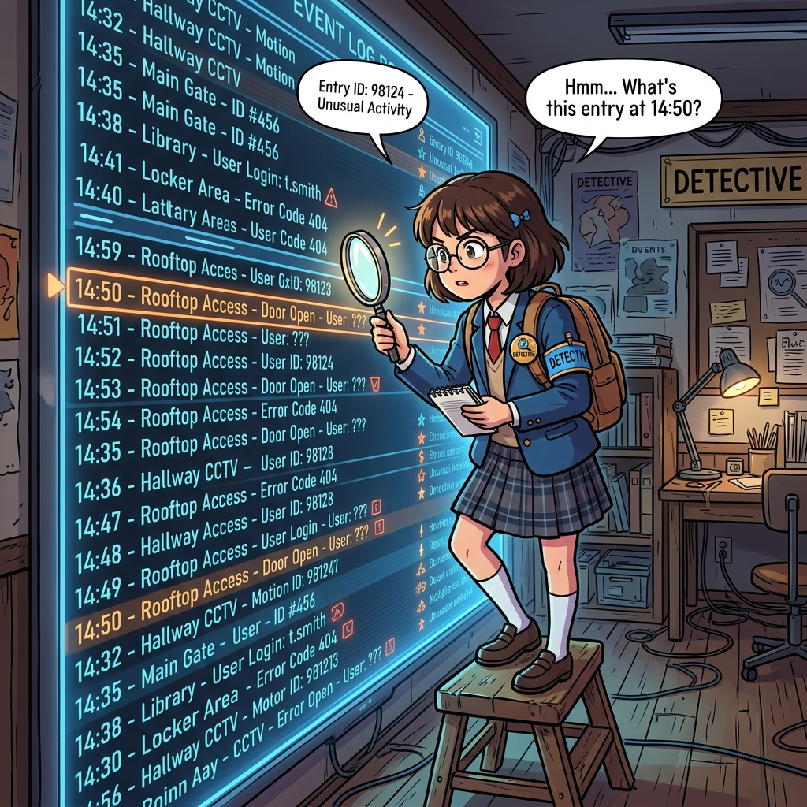

  

  <svg width="100%" height="200" viewBox="0 0 600 200" xmlns="http://www.w3.org/2000/svg"><rect width="100%" height="100%" fill="#1E1E1E" rx="10"/><rect x="50" y="50" width="150" height="100" fill="#333" rx="5"/><text x="125" y="105" fill="white" font-size="16" font-family="monospace" text-anchor="middle">Standard User</text><path d="M 210 100 L 390 100" stroke="#E81123" stroke-width="4" stroke-dasharray="5,5"/><text x="300" y="90" fill="#E81123" font-size="14" font-family="monospace" text-anchor="middle">UAC Elevation Request</text><rect x="400" y="50" width="150" height="100" fill="#0078D7" rx="5"/><text x="475" y="105" fill="white" font-size="16" font-family="monospace" text-anchor="middle">Administrator</text></svg>

# 3주차: 다중 사용자 환경과 시스템 권한 제어

 

- **대주제**: 다중 사용자 환경과 시스템 권한 제어
- **세부학습목표**: 컴퓨터 한 대에 여러 사람이 접속하거나, 외부 데몬이 실행될 때 윈도우가 사용하는 계정 통제 보안 메커니즘을 분석한다.

#### 📌 3-1. Windows 멀티유저 및 세션 관리
1. 로컬 계정 vs Microsoft(클라우드) 계정 아키텍처
2. 관리자(Administrator) 그룹과 윈도우 UAC(User Account Control) 방패
3. 동시에 여러 명 접속하기 (RDP, 원격 데스크톱 세션 분리)

#### 📌 3-2. 레지스트리와 서비스(Services.msc)
1. 윈도우의 거대한 뇌: 레지스트리 포맷(HKCU, HKLM) 탐험
2. 부팅 시 자동 시작되는 백그라운드 서비스 관리
3. 이벤트 뷰어(EventVwr)를 통한 권한 거부 로그 추적기

---

  

  <svg width="100%" height="200" viewBox="0 0 600 200" xmlns="http://www.w3.org/2000/svg"><rect width="100%" height="100%" fill="#1E1E1E" rx="10"/><text x="80" y="50" fill="#00FF00" font-size="20" font-family="monospace">Event Viewer (eventvwr.msc)</text><rect x="80" y="70" width="440" height="90" fill="#333"/><text x="100" y="100" fill="white" font-size="14" font-family="monospace">[Error] Event 1000 - Application Crash</text><text x="100" y="125" fill="#E81123" font-size="14" font-family="monospace">Faulting module name: ntdll.dll</text></svg>

---

## [심화 렉처] 윈도우 다중 사용자 환경

시스템 내부에는 `SYSTEM`, `LOCAL SERVICE` 같은 특권 아이디가 백그라운드 웹 서비스를 돌리고 있을 수 있습니다. 
UAC (사용자 계정 컨트롤) 경고 팝업이 뜨는 이유는 프로세스가 관리자(Administrator) 그룹으로 승급을 시도했기 때문입니다.

  <svg width="100%" height="120" viewBox="0 0 600 120" xmlns="http://www.w3.org/2000/svg"><rect width="100%" height="100%" fill="#1E1E1E" rx="10"/><text x="300" y="60" fill="white" font-size="20" font-family="monospace" text-anchor="middle">HKEY_LOCAL_MACHINE (HKLM) vs HKEY_CURRENT_USER (HKCU)</text></svg>

## [심화 렉처] 이벤트 뷰어로 에러 뚫어보기

오류 메시지 하나 없는 시스템 다운 증상을 겪는다면, 재부팅이 답이 아닙니다. 반드시 레지스트리 기반의 `이벤트 뷰어(Eventvwr.msc)` 시스템 로그를 뜯어봐야만 원인을 도출할 수 있습니다.
