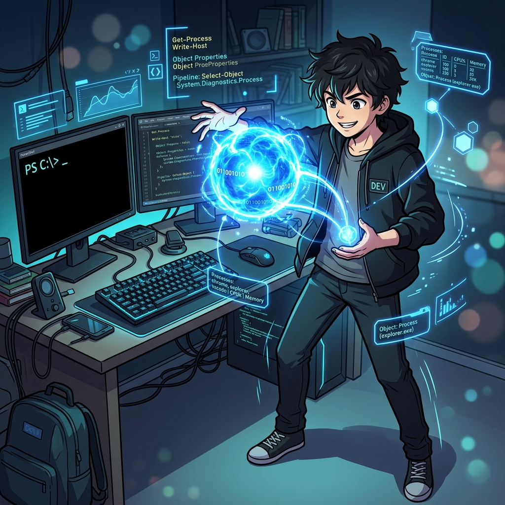

  

  <svg width="100%" height="200" viewBox="0 0 600 200" xmlns="http://www.w3.org/2000/svg"><rect width="100%" height="100%" fill="#1E1E1E" rx="10"/><rect x="50" y="40" width="200" height="120" fill="#333" rx="5"/><text x="150" y="75" fill="white" font-size="16" font-family="monospace" text-anchor="middle">bash (Text)</text><text x="150" y="105" fill="gray" font-size="14" font-family="monospace" text-anchor="middle">grep / awk</text><rect x="350" y="40" width="200" height="120" fill="#005A9E" rx="5"/><text x="450" y="75" fill="white" font-size="16" font-family="monospace" text-anchor="middle">PowerShell (Object)</text><text x="450" y="105" fill="#00FF00" font-size="14" font-family="monospace" text-anchor="middle">.WorkingSet > 1GB</text><path d="M 260 100 L 340 100" stroke="white" stroke-width="4"/></svg>

# 5주차: 차세대 프레임워크, PowerShell 객체 셸

 

- **대주제**: 차세대 프레임워크, PowerShell 객체 셸
- **세부학습목표**: CMD 텍스트 스트리밍에 지친 관리자를 위한 마이크로소프트의 역작, 닷넷(.NET) 기반 객체 언어인 PowerShell을 배운다.

#### 📌 5-1. PowerShell 이란?
1. 텍스트 문자열(String)이 아닌 객체(Object) 파이프라인의 충격
2. `PS C:\>` 명령어의 기본 규칙: `동사-명사 (Verb-Noun)`
3. 스크립트 실행 권한(`ExecutionPolicy`) 보안 정책 해제하기

#### 📌 5-2. 스크립트 코딩과 객체 접근
1. `Get-Process | Where-Object WorkingSet -gt 1GB | Stop-Process` 메모리 학살 스크립트 작성
2. WMI와 CIM 클래스를 이용해 하드웨어 시스템 온도, CPU 코어 모델명 출력해내기
3. `Profile.ps1` 파일을 이용한 터미널 자동화 및 Oh-My-Posh 프롬프트 테마 꾸미기

---

  

  <svg width="100%" height="200" viewBox="0 0 600 200" xmlns="http://www.w3.org/2000/svg"><rect width="100%" height="100%" fill="#1E1E1E" rx="10"/><text x="300" y="60" fill="white" font-size="20" font-family="monospace" text-anchor="middle">Verb-Noun Convention</text><rect x="100" y="90" width="400" height="60" fill="#333" rx="5"/><text x="300" y="125" fill="#00FF00" font-size="18" font-family="monospace" text-anchor="middle">Get-Process | Stop-Process</text></svg>

---

## [심화 렉처] 파워셸(PowerShell)의 탄생과 닷넷 객체 지향

마이크로소프트의 파워셸은 텍스트 파이프라인이 아니라, 모든 리턴값을 **닷넷(.NET) 객체(Object)** 로 반환합니다! `Get-Process` 값을 받으면 바로 객체의 `.WorkingSet` (메모리) 프라퍼티를 호출할 수 있습니다.

  <svg width="100%" height="120" viewBox="0 0 600 120" xmlns="http://www.w3.org/2000/svg"><rect width="100%" height="100%" fill="#1E1E1E" rx="10"/><text x="300" y="65" fill="#00FF00" font-size="18" font-family="monospace" text-anchor="middle">Set-ExecutionPolicy RemoteSigned</text></svg>

## [심화 렉처] 개발자 셸 환경 구축

`Start-Service` 처럼 동사와 명사(Verb-Noun) 구조 덕분에 가독성이 좋습니다. 초기 보안 차단된 스크립트 실행 권한(`ExecutionPolicy`)을 풀고 Oh-My-Posh 테마 설정 스크립트 기반을 확보합니다.
