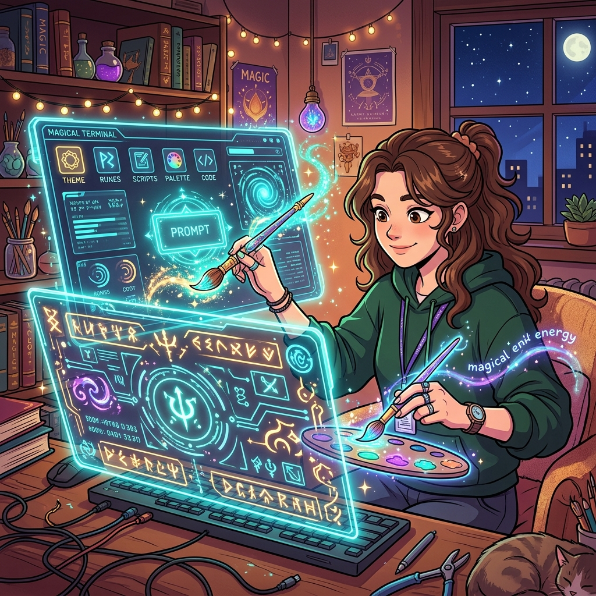

  

  <svg width="100%" height="200" viewBox="0 0 600 200" xmlns="http://www.w3.org/2000/svg"><rect width="100%" height="100%" fill="#1E1E1E" rx="10"/><text x="300" y="40" fill="white" font-size="20" font-family="monospace" text-anchor="middle">Windows Terminal Architecture</text><rect x="50" y="60" width="150" height="100" fill="#333" rx="5"/><text x="125" y="115" fill="white" font-size="16" font-family="monospace" text-anchor="middle">cmd.exe</text><rect x="225" y="60" width="150" height="100" fill="#005A9E" rx="5"/><text x="300" y="115" fill="white" font-size="16" font-family="monospace" text-anchor="middle">PowerShell</text><rect x="400" y="60" width="150" height="100" fill="#E95420" rx="5"/><text x="475" y="115" fill="white" font-size="16" font-family="monospace" text-anchor="middle">WSL2 (Ubuntu)</text></svg>

# 6주차: 터미널의 혁신, Windows Terminal

 

- **대주제**: 터미널의 혁신, Windows Terminal
- **세부학습목표**: 고전적인 파란 창과 검은 창을 합쳐 21세기에 걸맞은 GPU 가속 터미널을 구축한다.

#### 📌 6-1. GPU 하드웨어 가속 Terminal
1. `conhost.exe` 를 버리다. Windows Terminal 엔진 아키텍처
2. `settings.json` 설정 프로그래밍

#### 📌 6-2. 다중 쉘 융합 구성
1. CMD, PowerShell, Git Bash, WSL 을 하나의 윈도우 앱 탭으로 묶어버리기
2. 폰트(Cascadia Code, D2Coding) 및 컬러 테마 맵핑
3. 분할 화면 (Split Pane) 생산성 실습

---

  

  <svg width="100%" height="200" viewBox="0 0 600 200" xmlns="http://www.w3.org/2000/svg"><rect width="100%" height="100%" fill="#1E1E1E" rx="10"/><rect x="80" y="40" width="440" height="120" fill="#333" rx="5"/><text x="100" y="70" fill="#00FF00" font-size="14" font-family="monospace">"profiles": {{</text><text x="120" y="90" fill="#00FF00" font-size="14" font-family="monospace">"defaultProfile": "{{ubuntu-guid}}",</text><text x="120" y="110" fill="#00FF00" font-size="14" font-family="monospace">"useAcrylic": true</text><text x="100" y="130" fill="#00FF00" font-size="14" font-family="monospace">}}</text></svg>

---

## [심화 렉처] 터미널 엔진의 진화, Windows Terminal

과거 `cmd` 창은 렌더링이 극한으로 느렸습니다. 마소가 만든 `Windows Terminal` 은 코어에 GPU 가속 텍스트 엔진을 지니고 압도적 속도를 냅니다. `settings.json` 스크립트를 건드려 우분투(WSL) 콘솔 창을 병합하고 단축키로 다중 분할 창(Split Panes) 작업을 시뮬레이션 합니다.

  <svg width="100%" height="120" viewBox="0 0 600 120" xmlns="http://www.w3.org/2000/svg"><rect width="100%" height="100%" fill="#1E1E1E" rx="10"/><text x="300" y="65" fill="#0078D7" font-size="20" font-family="monospace" text-anchor="middle">GPU Accelerated DirectWrite Text Rendering</text></svg>

