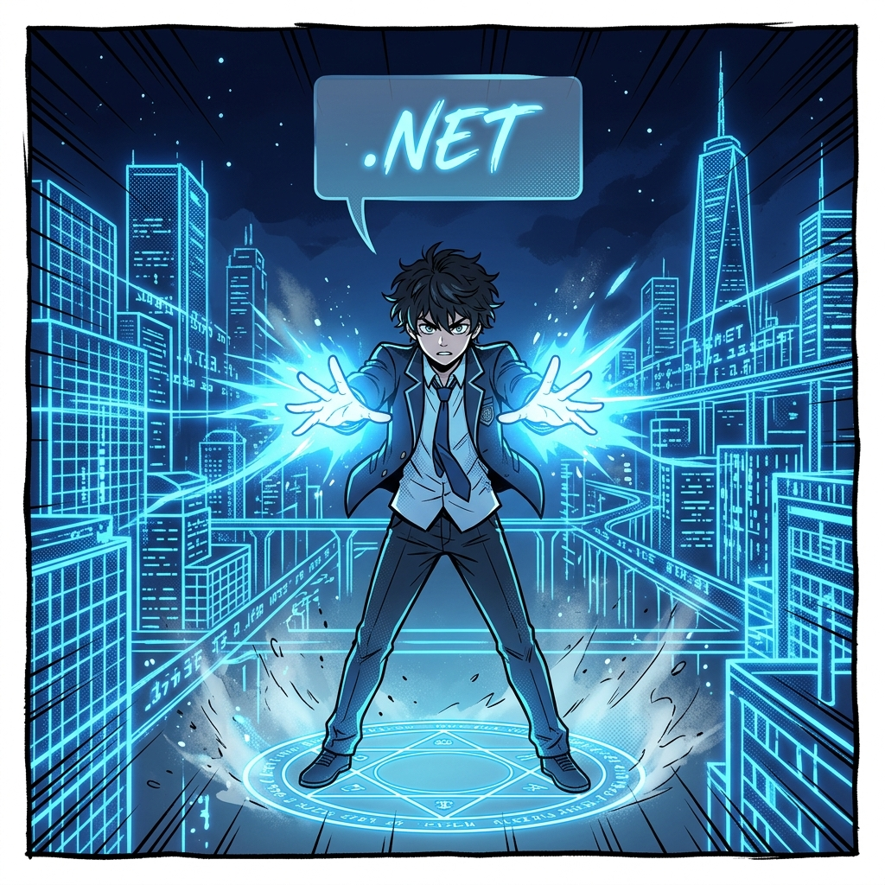

  

  <svg width="100%" height="200" viewBox="0 0 600 200" xmlns="http://www.w3.org/2000/svg"><rect width="100%" height="100%" fill="#1E1E1E" rx="10"/><rect x="50" y="50" width="120" height="100" fill="#5C2D91" rx="5"/><text x="110" y="105" fill="white" font-size="16" font-family="monospace" text-anchor="middle">C# Source</text><path d="M 180 100 L 250 100" stroke="white" stroke-width="3" marker-end="url(#a)"/><rect x="250" y="50" width="120" height="100" fill="#333" rx="5"/><text x="310" y="105" fill="#00FF00" font-size="16" font-family="monospace" text-anchor="middle">csc.exe</text><path d="M 380 100 L 450 100" stroke="white" stroke-width="3" marker-end="url(#a)"/><rect x="450" y="50" width="120" height="100" fill="#0078D7" rx="5"/><text x="510" y="105" fill="white" font-size="16" font-family="monospace" text-anchor="middle">Hello.exe</text><defs><marker id="a" viewBox="0 0 10 10" refX="5" refY="5" markerWidth="6" markerHeight="6" orient="auto"><path d="M 0 0 L 10 5 L 0 10 z" fill="white"/></marker></defs></svg>

# 8주차: Windows 네이티브 프로그래밍과 C#

 

- **대주제**: Windows 네이티브 프로그래밍과 C#
- **세부학습목표**: 윈도우 OS를 구성하는 핵심 철학인 .NET 프레임워크와 마이크로소프트의 주력 언어 C#을 체험한다.

#### 📌 8-1. C# 이란 무엇인가?
1. C, C++, Java 사이에서 태어난 가장 모던한 객체지향 언어
2. 닷넷(.NET) 공통 언어 런타임(CLR) 과 가비지 컬렉션 아키텍처
3. Visual Studio, C# 컴파일러(CSC) 호출 작동 원리

#### 📌 8-2. Hello World! 그리고 GUI 앱 제작
1. `.cs` 파일 작성 후 네이티브 터미널에서 콘솔 앱 컴파일 및 `Hello World`
2. WinForms 와 WPF (Windows Presentation Foundation) 구조 개요
3. C# 응용프로그램이 윈도우 메모리(RAM)와 운영체제 핸들을 제어하는 방법

---

  

  <svg width="100%" height="200" viewBox="0 0 600 200" xmlns="http://www.w3.org/2000/svg"><rect width="100%" height="100%" fill="#1E1E1E" rx="10"/><circle cx="300" cy="100" r="80" fill="none" stroke="#68217A" stroke-width="6"/><text x="300" y="105" fill="#68217A" font-size="24" font-family="monospace" text-anchor="middle">.NET Core CLR</text><text x="300" y="130" fill="gray" font-size="14" font-family="monospace" text-anchor="middle">(Garbage Collector)</text></svg>

---

## [심화 렉처] 윈도우 네이티브의 본질: C# (.NET)

C, C++의 구조적 복잡성을 탈피하고 닷넷 프레임워크의 강력한 가비지 컬렉터의 혜택을 받는 언어가 C# 입니다. 윈도우 커널과 메모리를 가장 유기적으로 제어할 수 있습니다.

  <svg width="100%" height="120" viewBox="0 0 600 120" xmlns="http://www.w3.org/2000/svg"><rect width="100%" height="100%" fill="#1E1E1E" rx="10"/><text x="300" y="65" fill="#00FF00" font-size="18" font-family="monospace" text-anchor="middle">C:\Windows\Microsoft.NET\Framework64\v4.0.30319\csc.exe</text></svg>

## [심화 렉처] 터미널 기반 Hello World 네이티브 컴파일

무거운 Visual Studio 를 켜지 않고 메모장으로 `Program.cs`를 작성한 뒤 터미널 `csc.exe` 빌드 훅을 날려 `Hello.exe` 파일을 직접 찍어내면서 닷넷 컴파일의 파이프라인 구조를 확인합니다.
