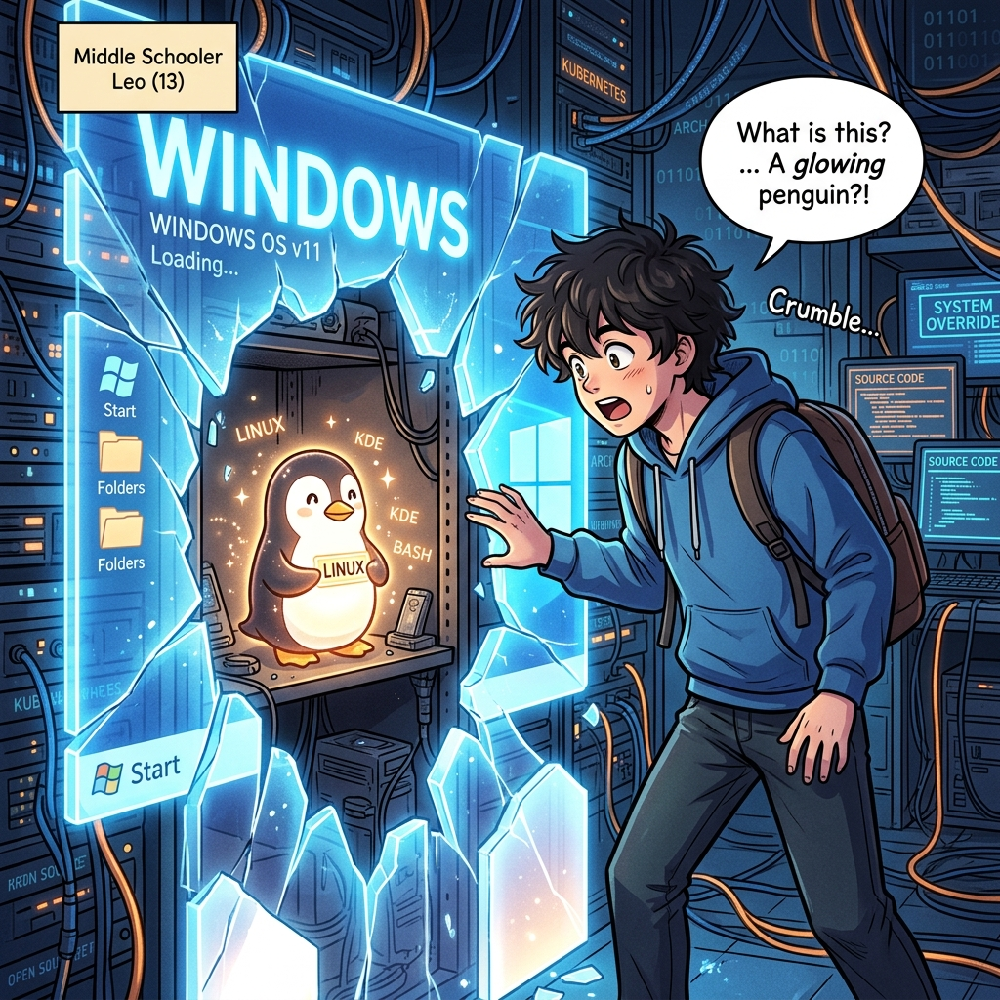
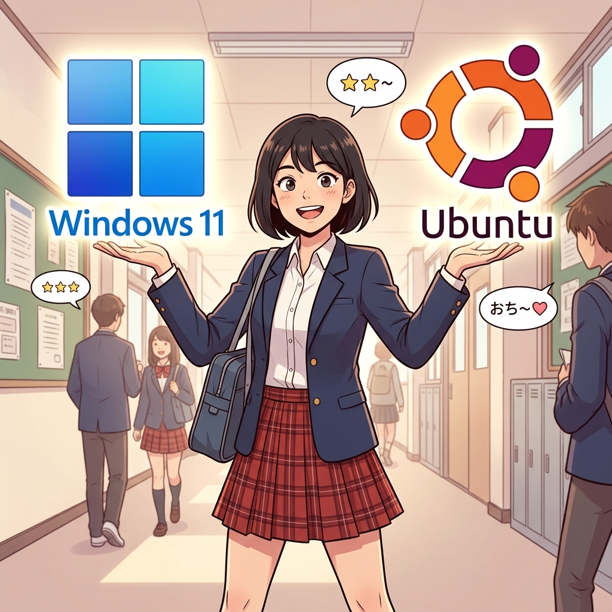

  

  <svg width="100%" height="200" viewBox="0 0 600 200" xmlns="http://www.w3.org/2000/svg"><rect width="100%" height="100%" fill="#1E1E1E" rx="10"/><rect x="50" y="80" width="200" height="80" fill="#0078D7" rx="5"/><text x="150" y="125" fill="white" font-size="18" font-family="monospace" text-anchor="middle">Windows NT Kernel</text><rect x="350" y="80" width="200" height="80" fill="#E95420" rx="5"/><text x="450" y="125" fill="white" font-size="18" font-family="monospace" text-anchor="middle">Linux Kernel</text><rect x="50" y="30" width="500" height="30" fill="#333" rx="5"/><text x="300" y="50" fill="#00FF00" font-size="16" font-family="monospace" text-anchor="middle">Hyper-V Hypervisor Layer</text></svg>

# 9주차: 하이브리드 엔진, WSL2 아키텍처

 

- **대주제**: 하이브리드 엔진, WSL2 아키텍처
- **세부학습목표**: 리눅스 커널을 유틸리티 가상머신(Hyper-V)에 태워 윈도우에 박아버린 MS 최후의 카드, WSL2를 해부한다.

#### 📌 9-1. WSL1의 한계와 WSL2의 마이크로 커널
1. 시스템 콜 번역(WSL1)에서 독립 하드웨어 가상화(WSL2)로
2. 왜 파일 시스템 I/O 속도가 수백 배 비약했는가?
3. 윈도우 `C:\` 드라이브와 리눅스 `/mnt/c/` 간의 9P 네트워크 공유 프로토콜

#### 📌 9-2. 우분투 환경 통합
1. `wsl --install` 명령어 통제
2. VHDx 형식 디스크 공간 관리 (가상 디스크 압축하기)
3. Windows 11 속에서 리눅스 GUI 에뮬레이팅 앱(WSLg) 사용해보기

---

  

  <svg width="100%" height="200" viewBox="0 0 600 200" xmlns="http://www.w3.org/2000/svg"><rect width="100%" height="100%" fill="#1E1E1E" rx="10"/><path d="M 200 100 Q 300 20 400 100" fill="none" stroke="#00FF00" stroke-width="4" stroke-dasharray="5,5"/><text x="300" y="60" fill="#00FF00" font-size="16" font-family="monospace" text-anchor="middle">9P Network Protocol Share</text><text x="150" y="140" fill="white" font-size="20" font-family="monospace" text-anchor="middle">\\wsl$\Ubuntu</text><text x="450" y="140" fill="white" font-size="20" font-family="monospace" text-anchor="middle">/mnt/c/</text></svg>

---

## [심화 렉처] WSL2 의 극강 통신 아키텍처

윈도우 OS 커널 뒤에 `Hyper-V` 모듈을 통한 진짜 리눅스 커널을 세팅합니다. 윈도우에서 `\\wsl$\Ubuntu` 주소를 통해 리눅스의 ext4 포맷 내부로 침투하는 이 미친 하이브리드 파일 브릿지 시스템의 기술적 동작 원리를 이해해야 합니다.

  <svg width="100%" height="120" viewBox="0 0 600 120" xmlns="http://www.w3.org/2000/svg"><rect width="100%" height="100%" fill="#1E1E1E" rx="10"/><text x="300" y="65" fill="white" font-size="24" font-family="monospace" text-anchor="middle">wsl --install -d Ubuntu-22.04</text></svg>

